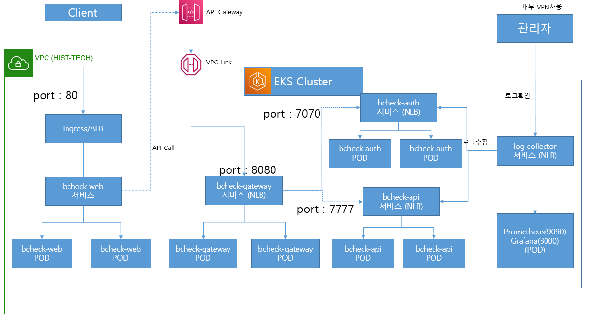
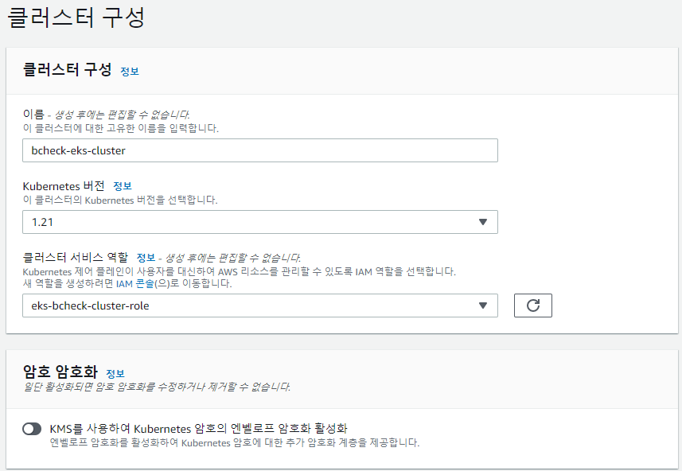
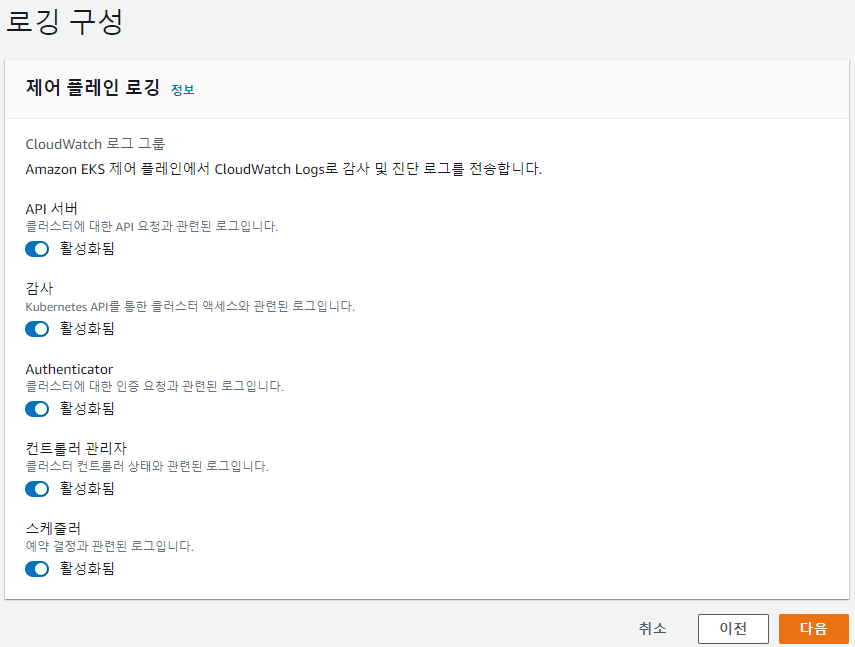
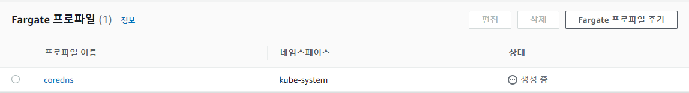
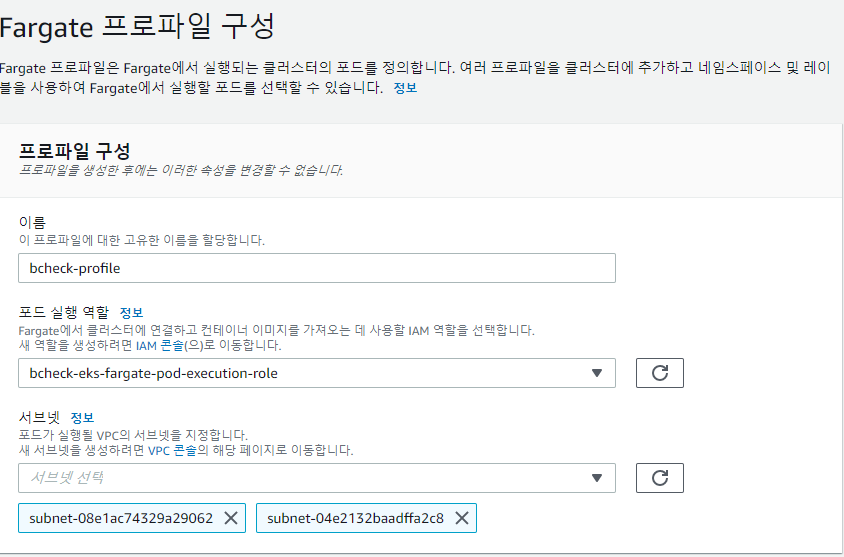
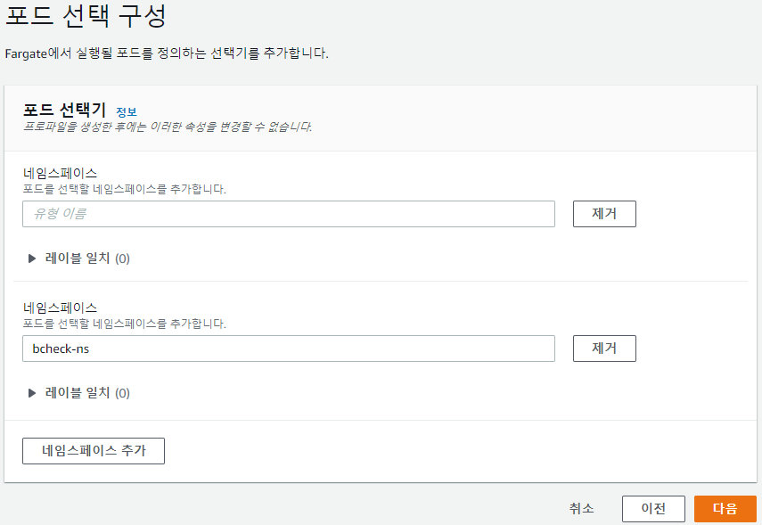
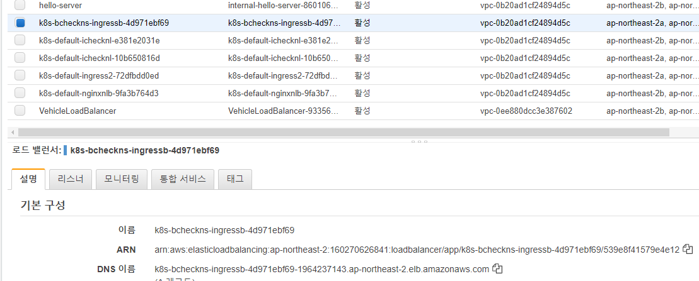
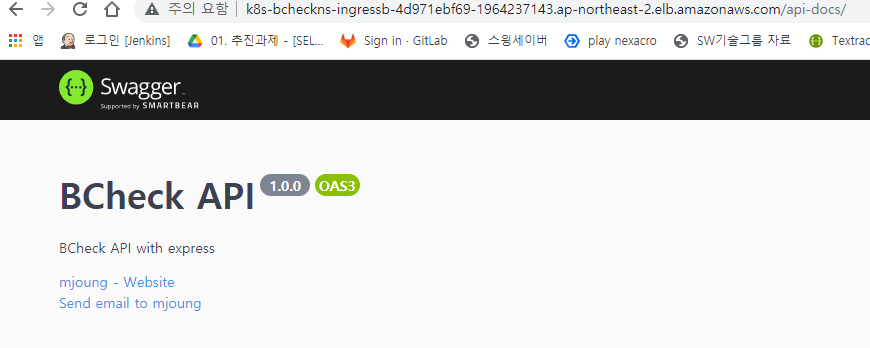
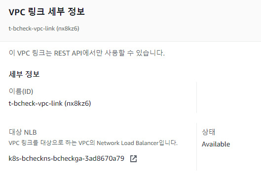
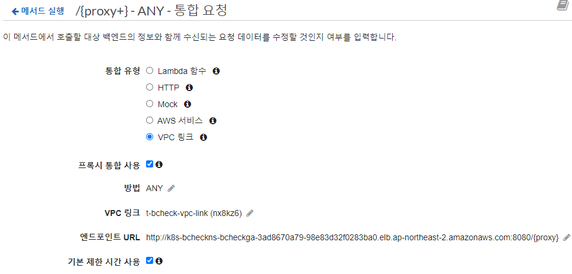

## EKS Cluster 생성 및 어플리케이션 배포 
본 문서는 EKS Cluster를 구성하고 Cluster에 어플리케이션을 배포하는 일련의 절차를 설명한다.   
Author : minsoub@gmail.com  
### VPC에서 dns 확인 및 호스트 이름 활성화
- 생성한 VPC에서 작업영역에서 DNS 확인 편집과 DNS 호스트 이름 편집 작업
  DNS 확인 - 활성화됨   
  DNS 호스트 이름 - 활성화됨
- DNS 활성화하는 이유는 AWS에서 EKS Master와 ETCD 노드를 관리하기 위해 EKS 플랫폼에 구축을 하게 되는데
- 이 플랫폼안에 만들어진 마스터와 VPC Worker Node는 Private로 통신함.
- VPC Endpoints 구성을 위해서는 DNS에 관한 부분이 활성화 되어야 제대로 클러스터가 구성

### EKS Cluster 구성 화면

- 완성된 EKS Service
```shell
[ec2-user@ip-10-100-0-124 ~]$ kubectl get svc -n bcheck-ns
NAME                                TYPE           CLUSTER-IP       EXTERNAL-IP                                                                          PORT(S)                         AGE
aws-load-balancer-webhook-service   ClusterIP      172.20.72.168    <none>                                                                               443/TCP                         3d21h
bcheck-api-nlb                      LoadBalancer   172.20.13.100    k8s-bcheckns-bcheckap-d61505cba7-0fc9ad505d9e76e2.elb.ap-northeast-2.amazonaws.com   7777:32517/TCP                  2d2h
bcheck-gateway-nlb                  LoadBalancer   172.20.200.118   k8s-bcheckns-bcheckga-3ad8670a79-98e83d32f0283ba0.elb.ap-northeast-2.amazonaws.com   8080:31533/TCP                  22h
bcheck-web-alb                      NodePort       172.20.204.177   <none>                                                                               80:31606/TCP                    23h
log-nlb                             LoadBalancer   172.20.225.210   k8s-bcheckns-lognlb-22b629f1c6-495a2ec67945c5f0.elb.ap-northeast-2.amazonaws.com     9090:31128/TCP,3000:31039/TCP   54m
[ec2-user@ip-10-100-0-124 ~]$
```
- 완성된 EKS Deployment
```shell
[ec2-user@ip-10-100-0-124 ~]$ kubectl get deployment -n bcheck-ns
NAME                           READY   UP-TO-DATE   AVAILABLE   AGE
app-log                        1/1     1            1           88m
aws-load-balancer-controller   2/2     2            2           3d21h
bcheck-api                     3/3     3            3           2d2h
bcheck-gateway-api             2/2     2            2           3d20h
bcheck-web                     2/2     2            2           24h
[ec2-user@ip-10-100-0-124 ~]$
```
- 완성된 EKS Pod
```shell
[ec2-user@ip-10-100-0-124 ~]$ kubectl get pod -n bcheck-ns
NAME                                            READY   STATUS    RESTARTS   AGE
app-log-7d8f4fb4f6-gnxw5                        2/2     Running   0          77m
aws-load-balancer-controller-7d5bbfc4b6-cqzsq   1/1     Running   0          3d21h
aws-load-balancer-controller-7d5bbfc4b6-ffcf9   1/1     Running   0          3d21h
bcheck-api-5b448f8b44-428fr                     1/1     Running   0          46h
bcheck-api-5b448f8b44-vmv9h                     1/1     Running   0          46h
bcheck-api-5b448f8b44-x25h5                     1/1     Running   0          46h
bcheck-gateway-api-6fffc9f896-jp629             1/1     Running   0          30h
bcheck-gateway-api-6fffc9f896-pscvb             1/1     Running   0          30h
bcheck-web-78d495bcc7-cb4cs                     1/1     Running   0          23h
bcheck-web-78d495bcc7-zp879                     1/1     Running   0          23h
[ec2-user@ip-10-100-0-124 ~]$
```
### Cluster Role과 Worker Node Role 생성 
- EKS Cluster Role
  - ROLE 생성
    - AmazonEKSClusterPolicy
    - AmazonEKSServicePolicy
  - CLI를 통해서 생성한다.   
    source : eks-bcheck-cluster-role.json   
    role name : eks-bcheck-cluster-role
```json
{
  "Version": "2012-10-17",
  "Statement": [
    {
      "Effect": "Allow",
      "Principal": {
        "Service": "eks.amazonaws.com"
      },
      "Action": "sts:AssumeRole"
    }
  ]
}
```  
```shell
aws iam create-role --role-name eks-bcheck-cluster-role --assume-role-policy-document file://src/eks-bcheck-cluster-role.json
aws iam attach-role-policy --role-name eks-bcheck-cluster-role --policy-arn arn:aws:iam::aws:policy/AmazonEKSClusterPolicy
aws iam attach-role-policy --role-name eks-bcheck-cluster-role --policy-arn arn:aws:iam::aws:policy/AmazonEKSServicePolicy
```    
  - Role 확인
```shell
minsoub@DESKTOP-CQM34B1:/mnt/c/DevPJT/bcheck-eks-setup-pjt$ aws iam list-roles --query "Roles[?RoleName == 'eks-bcheck-cluster-role']"
[
    {
        "Path": "/",
        "RoleName": "eks-bcheck-cluster-role",
        "RoleId": "AROASKUG7WAMWCQ54V3VE",
        "Arn": "arn:aws:iam::160270626841:role/eks-bcheck-cluster-role",
        "CreateDate": "2021-08-27T04:19:28Z",
        "AssumeRolePolicyDocument": {
            "Version": "2012-10-17",
            "Statement": [
                {
                    "Effect": "Allow",
                    "Principal": {
                        "Service": "eks.amazonaws.com"
                    },
                    "Action": "sts:AssumeRole"
                }
            ]
        },
        "MaxSessionDuration": 3600
    }
]
```
- Worker Node Role   
  Worker Node Role 생성 
  - WorkerNode Policy
  - 컨테이너 이미지 접근을 위한 ECR
  - 로그 관리는 CloudwatchLogsFullAccess
  - VPC의 CIDR를 가지고 매핑 구성을 위한 CNI와 관련된 Policy
  - ELB 구성 했을 때 자동적으로 DNS 매핑을 구성을 위한 Route53 Policy
  - HPA, AutoScailer와 같은 정책을 수행하기 위한 EKS-AutoScailer
  - ALB 연동을 위한 ALBIngreddControllerIAMPolicy   
  - CLI를 통한 구성
    - eks-bcheck-worker-role.json
    ```json
    {
      "Version": "2012-10-17",
      "Statement": [
        {
          "Effect": "Allow",
          "Principal": {
            "Service": "ec2.amazonaws.com"
          },
          "Action": "sts:AssumeRole"
        }
      ]
    }
    ```
    cli command
    ```shell
    aws iam create-role --role-name eks-bcheck-worker-role --assume-role-policy-document file://src/eks-bcheck-worker-role.json
    aws iam attach-role-policy --role-name eks-bcheck-worker-role --policy-arn arn:aws:iam::aws:policy/AmazonEKSWorkerNodePolicy
    aws iam attach-role-policy --role-name eks-bcheck-worker-role --policy-arn arn:aws:iam::aws:policy/AmazonEC2ContainerRegistryReadOnly
    aws iam attach-role-policy --role-name eks-bcheck-worker-role --policy-arn arn:aws:iam::aws:policy/CloudWatchLogsFullAccess
    aws iam attach-role-policy --role-name eks-bcheck-worker-role --policy-arn arn:aws:iam::aws:policy/AmazonEKS_CNI_Policy
    aws iam attach-role-policy --role-name eks-bcheck-worker-role --policy-arn arn:aws:iam::aws:policy/AmazonRoute53FullAccess
    ```
    - bcheck-EKSAutoscailerPolicy.json
    ```json
    {
       "Version": "2012-10-17",
       "Statement": [
           {
             "Action": [
                "autoscaling:DescribeAutoScalingGroups",
                "autoscaling:DescribeAutoScalingInstances",
                "autoscaling:DescribeLaunchConfigurations",
                "autoscaling:DescribeTags",
                "autoscaling:SetDesiredCapacity",
                "autoscaling:TerminateInstanceInAutoScalingGroup",
                "ec2:DescribeLaunchTemplateVersions"
             ],
             "Resource": "*",
             "Effect": "Allow"
          }
       ]
    }    
    ```
    cli command
    ```shell
    aws iam create-policy --policy-name bcheck-EKSAutoscailerPolicy --policy-document file://src/bcheck-EKSAutoscailerPolicy.json
    aws iam attach-role-policy --role-name eks-bcheck-worker-role --policy-arn arn:aws:iam::160270626841:policy/bcheck-EKSAutoscailerPolicy    
    ```
    - bcheck-ALBIngressControllerPolicy.json
    ```json
    {
       "Version": "2012-10-17",
       "Statement": [
         {
            "Effect": "Allow",
            "Action": [
               "acm:DescribeCertificate",
               "acm:ListCertificates",
               "acm:GetCertificate"
            ],
            "Resource": "*"
         },
         {
            "Effect": "Allow",
            "Action": [
               "ec2:AuthorizeSecurityGroupIngress",
               "ec2:CreateSecurityGroup",
               "ec2:CreateTags",
               "ec2:DeleteTags",
               "ec2:DeleteSecurityGroup",
               "ec2:DescribeAccountAttributes",
               "ec2:DescribeAddresses",
               "ec2:DescribeInstances",
               "ec2:DescribeInstanceStatus",
               "ec2:DescribeInternetGateways",
               "ec2:DescribeNetworkInterfaces",
               "ec2:DescribeSecurityGroups",
               "ec2:DescribeSubnets",
               "ec2:DescribeTags",
               "ec2:DescribeVpcs",
               "ec2:ModifyInstanceAttribute",
               "ec2:ModifyNetworkInterfaceAttribute",
               "ec2:RevokeSecurityGroupIngress"
            ],
            "Resource": "*"
         },
         {
            "Effect": "Allow",
            "Action": [
               "elasticloadbalancing:AddListenerCertificates",
               "elasticloadbalancing:AddTags",
               "elasticloadbalancing:CreateListener",
               "elasticloadbalancing:CreateLoadBalancer",
               "elasticloadbalancing:CreateRule",
               "elasticloadbalancing:CreateTargetGroup",
               "elasticloadbalancing:DeleteListener",
               "elasticloadbalancing:DeleteLoadBalancer",
               "elasticloadbalancing:DeleteRule",
               "elasticloadbalancing:DeleteTargetGroup",
               "elasticloadbalancing:DeregisterTargets",
               "elasticloadbalancing:DescribeListenerCertificates",
               "elasticloadbalancing:DescribeListeners",
               "elasticloadbalancing:DescribeLoadBalancers",
               "elasticloadbalancing:DescribeLoadBalancerAttributes",
               "elasticloadbalancing:DescribeRules",
               "elasticloadbalancing:DescribeSSLPolicies",
               "elasticloadbalancing:DescribeTags",
               "elasticloadbalancing:DescribeTargetGroups",
               "elasticloadbalancing:DescribeTargetGroupAttributes",
               "elasticloadbalancing:DescribeTargetHealth",
               "elasticloadbalancing:ModifyListener",
               "elasticloadbalancing:ModifyLoadBalancerAttributes",
               "elasticloadbalancing:ModifyRule",
               "elasticloadbalancing:ModifyTargetGroup",
               "elasticloadbalancing:ModifyTargetGroupAttributes",
               "elasticloadbalancing:RegisterTargets",
               "elasticloadbalancing:RemoveListenerCertificates",
               "elasticloadbalancing:RemoveTags",
               "elasticloadbalancing:SetIpAddressType",
               "elasticloadbalancing:SetSecurityGroups",
               "elasticloadbalancing:SetSubnets",
               "elasticloadbalancing:SetWebACL"
            ],
            "Resource": "*"
        },
        {
            "Effect": "Allow",
            "Action": [
               "iam:CreateServiceLinkedRole",
               "iam:GetServerCertificate",
               "iam:ListServerCertificates"
            ],
            "Resource": "*"
        },
        {
            "Effect": "Allow",
            "Action": [
               "cognito-idp:DescribeUserPoolClient"
            ],
            "Resource": "*"
        },
        {
            "Effect": "Allow",
            "Action": [
               "waf-regional:GetWebACLForResource",
               "waf-regional:GetWebACL",
               "waf-regional:AssociateWebACL",
               "waf-regional:DisassociateWebACL"
            ],
            "Resource": "*"
        },
        {
            "Effect": "Allow",
            "Action": [
               "tag:GetResources",
               "tag:TagResources"
            ],
            "Resource": "*"
        },
        {
            "Effect": "Allow",
            "Action": [
               "waf:GetWebACL"
            ],
            "Resource": "*"
        }
      ]
    }
    ```
    cli command
    ```shell
    aws iam create-policy --policy-name bcheck-ALBIngressControllerPolicy --policy-document file://src/bcheck-ALBIngressControllerPolicy.json
    aws iam attach-role-policy --role-name eks-bcheck-worker-role --policy-arn arn:aws:iam::160270626841:policy/bcheck-ALBIngressControllerPolicy
    ```
### AWS Console에서 EKS Cluster 구축
- Security Group은 Cluster SG와 Worker Node SG가 서로 세팅되어야 하는 부분이 있어 고려되어야 함. 
- ELB 구성을 kubectl과 yaml을 통해 내부에서만 만들고 Pod들과 매핑할 수 있기 때문에 퍼블릭 서브넷을 클러스터안에서 포함시켜 구성하지 않을 경우에는 Private ELB 밖에 구성할 없음.
- 따라서 퍼블릭 ELB를 통해 내부망 통신으로 내부 워커노드들과 통신하는 형태를 구성하려면 꼭 Public 서브넷까지 포함시켜서 클러스터를 구성해주어야 한다. 
- 
  클러스터 서비스 역할에서 이전에 생성한 Cluster Role을 선택한다. (eks-bcheck-cluster-role)
- 네트워크 구성 
  Public 서브넷과 Private 서브넷을 같이 구성한다.  
  VPC : VPC_HIST_TECH   
  Subnet :   
     - TECH_ICHECK_APP_SUBNET_2A(10.100.30.0/24),
     - TECH_ICHECK_APP_SUBNET_2B(10.100.31.0/24),
     - TECH_PUBLIC_SUBNET_2A(10.100.0.0/24),
     - TECH_PUBLIC_SUBNET_2B(10.100.1.0/24)   
  네트워크 보안그룹 선택 : SG_MGMT_ADMIN   
- 

### Cluster 구성 작업
- CoreDNS 업데이트 구성 
  - Kubernetes 클러스터 내 Pod에서 어떤 도메인을 찾고자 할 때 Kube-system 네임스페이스에 실행되고 있는 CoreDNS가 네임서버로 사용
  - AWS EKS에서 Fargate를 구성 사용시 CoreDNS 배포를 수정해야 한다. 또한 CoreDNS를 대상으로 지정하는 Fargate 프로파일을 생성해야 한다. 
- Fargate 생성전 Fargate Pod를 실행할 수 있는 IAM Role을 생성 
   ```json
    {
      "Version": "2012-10-17",
      "Statement": [
        {
          "Effect": "Allow",
          "Principal": {
            "Service": "eks-fargate-pods.amazonaws.com"
          },
          "Action": "sts:AssumeRole"
        }
      ]
    }
   ```   
   - Empty Role을 생성 후 필요한 정책을 Attach 시킨다.  
   Role Name : bcheck-eks-fargate-pod-execution-role   
   Attach 할 Policy (서비스에 필요한 부분을 아래 attach-role-policy 명령으로 추가한다)
      - AmazonS3FullAccess
      - AmazonRDSFullAccess
      - CloudWatchLogsFullAccess
      - AWSXrayFullAccess
      - AmazonEKSFargatePodExecutionRolePolicy
      - AmazonSESFullAccess
      - AmazonEC2ContainerServiceforEC2Role
   ```shell
    aws iam create-role --role-name bcheck-eks-fargate-pod-execution-role --assume-role-policy-document file://src/empty.json
    aws iam attach-role-policy --role-name bcheck-eks-fargate-pod-execution-role --policy-arn arn:aws:iam::aws:policy/AmazonS3FullAccess
    aws iam attach-role-policy --role-name bcheck-eks-fargate-pod-execution-role --policy-arn arn:aws:iam::aws:policy/AmazonRDSFullAccess
    aws iam attach-role-policy --role-name bcheck-eks-fargate-pod-execution-role --policy-arn arn:aws:iam::aws:policy/CloudWatchLogsFullAccess
    aws iam attach-role-policy --role-name bcheck-eks-fargate-pod-execution-role --policy-arn arn:aws:iam::aws:policy/AWSXrayFullAccess
    aws iam attach-role-policy --role-name bcheck-eks-fargate-pod-execution-role --policy-arn arn:aws:iam::aws:policy/AmazonEKSFargatePodExecutionRolePolicy
    aws iam attach-role-policy --role-name bcheck-eks-fargate-pod-execution-role --policy-arn arn:aws:iam::aws:policy/AmazonSESFullAccess
    aws iam attach-role-policy --role-name bcheck-eks-fargate-pod-execution-role --policy-arn arn:aws:iam::aws:policy/AmazonEC2ContainerServiceforEC2Role
   ```
- CoreDNS 사용할 Fargate 생성
   ```json
   {
     "fargateProfileName": "coredns",
     "clusterName": "bcheck-eks-cluster",
     "podExecutionRoleArn": "arn:aws:iam::160270626841:role/bcheck-eks-fargate-pod-execution-role",
     "subnets": [
       "subnet-08e1ac74329a29062",
       "subnet-04e2132baadffa2c8"
     ],
     "selectors": [
       {
         "namespace": "kube-system",
         "labels": {
           "k8s-app": "kube-dns"
         }
       }
     ]
   }
   ```
   ```shell
   aws eks create-fargate-profile --cli-input-json file://src/coredns.json
   ```
    
- CoreDNS 포드에서 eks.amazonaws.com/compute-type : ec2 주석을 아래와 명령어를 실행해서 제거해야 한다. 
   ```shell
   kubectl patch deployment coredns -n kube-system --type json -p='[{"op": "remove", "path": "/spec/template/metadata/annotations/eks.amazonaws.com~1compute-type"}]'
   ```   
   위의 명령을 실행하기 위해서는 EKS Cluster에 접속이 가능해야 한다. 아래 명령어를 사용해서 접속이 가능한다. (클러스터 생성자)
   ```shell
    minsoub@DESKTOP-CQM34B1:/mnt/c/DevPJT/bcheck-eks-setup-pjt$ aws eks --region ap-northeast-2 update-kubeconfig --name bcheck-eks-cluster
    Added new context arn:aws:eks:ap-northeast-2:160270626841:cluster/bcheck-eks-cluster to /home/minsoub/.kube/config
   ```
   아래처럼 에러가 발생하는 경우 => AWS VPN Client에 접속되어 있으면 종료 후 다시 하면 된다. 해당 부분 확인 필요
   ```shell
   minsoub@DESKTOP-CQM34B1:/mnt/c/DevPJT/bcheck-eks-setup-pjt$ kubectl get svc
   Unable to connect to the server: dial tcp: lookup 339522B1199E6C2400EFB52B124A98FC.gr7.ap-northeast-2.eks.amazonaws.com on 172.26.112.1:53: read udp 172.26.122.167:37390->172.26.112.1:53: i/o timeout
   ```
- CoreDNS Pod를 롤 아웃 트리거 한다. 
  ```shell
  kubectl rollout restart -n kube-system deployment.app/coredns
  ```
- CoreDNS를 업데이트 하면 워크로드 정보에서 준비완료
  ```shell
  minsoub@DESKTOP-CQM34B1:/mnt/c/DevPJT/bcheck-eks-setup-pjt$ kubectl get deployment -n kube-system coredns
  NAME      READY   UP-TO-DATE   AVAILABLE   AGE
  coredns   2/2     2            2           95m
  ```
### EKS Fargate Profile 생성 
- Cluster 선택 
   - 구성 > 컴퓨팅 > Fargate 프로파일
   - Fargate 프로파일 추가
   
   
- VPC subnet 태깅
  로드 밸런서 또는 수신 컨트롤러의 자동 서브넷 검색을 위해 Amazon EKS 클러스터의 Amazon VPC 서브넷에 태그를 지정한다.   
  https://aws.amazon.com/ko/premiumsupport/knowledge-center/eks-vpc-subnet-discovery/
  - Public Subnet 설정 
    Subnet : TECH_PUBLIC_SUBNET_2A, TECH_PUBLIC_SUBNET_2B  
    Tag Key : kubernetes.io/role/elb  Value : 1
  - Private Subnet 설정 
    TECH_ICHECK_APP_SUBNET_2A, TECH_ICHECK_APP_SUBNET_2B  
  - Tag Key : kubernetes.io/role/internal-elb  Value: 1

### AWS Load Balancer Controller 설치 구성 
- Amazon EKS 클러스터에 AWS load balancer controller 는 kubernetes 클러스터용 Elastic Load Balancer 를 관리하는 컨트롤러.
- 이 컨트롤러는 클러스터에 직접 설치해야 한다. 
- 설치 절차 
  - iam_policy.json 파일을 다운로드 받는다. 
  ```shell
   curl -o iam_policy.json https://raw.githubusercontent.com/kubernetes-sigs/aws-load-balancer-controller/v2.2.0/docs/install/iam_policy.json
  ```
  ```json
  {
     "Version": "2012-10-17",
     "Statement": [
        {
           "Effect": "Allow",
           "Action": [
              "iam:CreateServiceLinkedRole",
              "ec2:DescribeAccountAttributes",
              "ec2:DescribeAddresses",
              "ec2:DescribeAvailabilityZones",
              "ec2:DescribeInternetGateways",
              "ec2:DescribeVpcs",
              "ec2:DescribeSubnets",
              "ec2:DescribeSecurityGroups",
              "ec2:DescribeInstances",
              "ec2:DescribeNetworkInterfaces",
              "ec2:DescribeTags",
              "ec2:GetCoipPoolUsage",
              "ec2:DescribeCoipPools",
              "elasticloadbalancing:DescribeLoadBalancers",
              "elasticloadbalancing:DescribeLoadBalancerAttributes",
              "elasticloadbalancing:DescribeListeners",
              "elasticloadbalancing:DescribeListenerCertificates",
              "elasticloadbalancing:DescribeSSLPolicies",
              "elasticloadbalancing:DescribeRules",
              "elasticloadbalancing:DescribeTargetGroups",
              "elasticloadbalancing:DescribeTargetGroupAttributes",
              "elasticloadbalancing:DescribeTargetHealth",
              "elasticloadbalancing:DescribeTags"
           ],
           "Resource": "*"
        },
        {
           "Effect": "Allow",
           "Action": [
              "cognito-idp:DescribeUserPoolClient",
              "acm:ListCertificates",
              "acm:DescribeCertificate",
              "iam:ListServerCertificates",
              "iam:GetServerCertificate",
              "waf-regional:GetWebACL",
              "waf-regional:GetWebACLForResource",
              "waf-regional:AssociateWebACL",
              "waf-regional:DisassociateWebACL",
              "wafv2:GetWebACL",
              "wafv2:GetWebACLForResource",
              "wafv2:AssociateWebACL",
              "wafv2:DisassociateWebACL",
              "shield:GetSubscriptionState",
              "shield:DescribeProtection",
              "shield:CreateProtection",
              "shield:DeleteProtection"
           ],
           "Resource": "*"
        },
        {
           "Effect": "Allow",
           "Action": [
              "ec2:AuthorizeSecurityGroupIngress",
              "ec2:RevokeSecurityGroupIngress"
           ],
           "Resource": "*"
        },
        {
           "Effect": "Allow",
           "Action": [
              "ec2:CreateSecurityGroup"
           ],
           "Resource": "*"
        },
        {
           "Effect": "Allow",
           "Action": [
              "ec2:CreateTags"
           ],
           "Resource": "arn:aws:ec2:*:*:security-group/*",
           "Condition": {
               "StringEquals": {
                   "ec2:CreateAction": "CreateSecurityGroup"
               },
               "Null": {
                   "aws:RequestTag/elbv2.k8s.aws/cluster": "false"
               }
           }
        },
        {
           "Effect": "Allow",
           "Action": [
              "ec2:CreateTags",
              "ec2:DeleteTags"
           ],
           "Resource": "arn:aws:ec2:*:*:security-group/*",
           "Condition": {
               "Null": {
                  "aws:RequestTag/elbv2.k8s.aws/cluster": "true",
                  "aws:ResourceTag/elbv2.k8s.aws/cluster": "false"
               }
           }
        },
        {
           "Effect": "Allow",
           "Action": [
              "ec2:AuthorizeSecurityGroupIngress",
              "ec2:RevokeSecurityGroupIngress",
              "ec2:DeleteSecurityGroup"
           ],
           "Resource": "*",
           "Condition": {
              "Null": {
                 "aws:ResourceTag/elbv2.k8s.aws/cluster": "false"
              }
           }
        },
        {
           "Effect": "Allow",
           "Action": [
              "elasticloadbalancing:CreateLoadBalancer",
              "elasticloadbalancing:CreateTargetGroup"
           ],
           "Resource": "*",
           "Condition": {
              "Null": {
              "aws:RequestTag/elbv2.k8s.aws/cluster": "false"
           }
        }
     },
     {
        "Effect": "Allow",
        "Action": [
           "elasticloadbalancing:CreateListener",
           "elasticloadbalancing:DeleteListener",
           "elasticloadbalancing:CreateRule",
           "elasticloadbalancing:DeleteRule"
        ],
        "Resource": "*"
     },
     {
        "Effect": "Allow",
        "Action": [
           "elasticloadbalancing:AddTags",
           "elasticloadbalancing:RemoveTags"
        ],
        "Resource": [
           "arn:aws:elasticloadbalancing:*:*:targetgroup/*/*",
           "arn:aws:elasticloadbalancing:*:*:loadbalancer/net/*/*",
           "arn:aws:elasticloadbalancing:*:*:loadbalancer/app/*/*"
        ],
        "Condition": {
           "Null": {
              "aws:RequestTag/elbv2.k8s.aws/cluster": "true",
              "aws:ResourceTag/elbv2.k8s.aws/cluster": "false"
           }
        }
     },
     {
        "Effect": "Allow",
        "Action": [
           "elasticloadbalancing:AddTags",
           "elasticloadbalancing:RemoveTags"
        ],
        "Resource": [
           "arn:aws:elasticloadbalancing:*:*:listener/net/*/*/*",
           "arn:aws:elasticloadbalancing:*:*:listener/app/*/*/*",
           "arn:aws:elasticloadbalancing:*:*:listener-rule/net/*/*/*",
           "arn:aws:elasticloadbalancing:*:*:listener-rule/app/*/*/*"
        ]
     },
     {
        "Effect": "Allow",
        "Action": [
           "elasticloadbalancing:ModifyLoadBalancerAttributes",
           "elasticloadbalancing:SetIpAddressType",
           "elasticloadbalancing:SetSecurityGroups",
           "elasticloadbalancing:SetSubnets",
           "elasticloadbalancing:DeleteLoadBalancer",
           "elasticloadbalancing:ModifyTargetGroup",
           "elasticloadbalancing:ModifyTargetGroupAttributes",
           "elasticloadbalancing:DeleteTargetGroup"
        ],
        "Resource": "*",
        "Condition": {
           "Null": {
              "aws:ResourceTag/elbv2.k8s.aws/cluster": "false"
           }
        }
     },
     {
        "Effect": "Allow",
        "Action": [
           "elasticloadbalancing:RegisterTargets",
           "elasticloadbalancing:DeregisterTargets"
        ],
        "Resource": "arn:aws:elasticloadbalancing:*:*:targetgroup/*/*"
     },
     {
        "Effect": "Allow",
        "Action": [
           "elasticloadbalancing:SetWebAcl",
           "elasticloadbalancing:ModifyListener",
           "elasticloadbalancing:AddListenerCertificates",
           "elasticloadbalancing:RemoveListenerCertificates",
           "elasticloadbalancing:ModifyRule"
        ],
        "Resource": "*"
     }
   ]
  }
  ```
  ```shell
  aws iam create-policy --policy-name bcheck-awsloadbalancercontroller-iampolicy --policy-document file://iam_policy.json
  ```
  - OID 공급자 생성 
  https://docs.aws.amazon.com/ko_kr/eks/latest/userguide/enable-iam-roles-for-service-accounts.html  
  ```shell
  # eksctl install
  curl --silent --location "https://github.com/weaveworks/eksctl/releases/latest/download/eksctl_$(uname -s)_amd64.tar.gz" | tar xz -C /tmp
  sudo mv -v /tmp/eksctl /usr/local/bin
  eksctl version
  ```
  ```shell
  minsoub@DESKTOP-CQM34B1:/mnt/c/DevPJT/bcheck-eks-setup-pjt/src$ eksctl utils associate-iam-oidc-provider --cluster bcheck-eks-cluster --approve
  2021-08-27 17:31:01 [ℹ]  eksctl version 0.62.0
  2021-08-27 17:31:01 [ℹ]  using region ap-northeast-2
  2021-08-27 17:31:03 [ℹ]  will create IAM Open ID Connect provider for cluster "bcheck-eks-cluster" in "ap-northeast-2"
  2021-08-27 17:31:03 [✔]  created IAM Open ID Connect provider for cluster "bcheck-eks-cluster" in "ap-northeast-2"
  minsoub@DESKTOP-CQM34B1:/mnt/c/DevPJT/bcheck-eks-setup-pjt/src$
  ```
  - IAM역할을 생성하고 Kubernetes 서비스 계정을 생성한다. 
    - aws-load-balancer-controller의 bcheck-ns 네임스페이스에 AWS Load Balancer 컨트롤러 이름 설정
    - bcheck-awsloadbalancercontroller-iampolicy 을 위한 role 생성 
    - role name : eks-bcheck-cluster-addon-iamserviceaccount-role
    ```shell
    eksctl create iamserviceaccount \
      --cluster=bcheck-eks-cluster \
      --namespace=bcheck-ns \
      --name=bcheck-aws-load-balancer-controller \
      --attach-policy-arn=arn:aws:iam::160270626841:policy/bcheck-awsloadbalancercontroller-iampolicy \
      --override-existing-serviceaccounts \
      --approve
    ```
    ```shell
    minsoub@DESKTOP-CQM34B1:/mnt/c/DevPJT/bcheck-eks-setup-pjt/src$     eksctl create iamserviceaccount \
    >       --cluster=bcheck-eks-cluster \
    >       --namespace=bcheck-ns \
    >       --name=bcheck-aws-load-balancer-controller \
    >       --attach-policy-arn=arn:aws:iam::160270626841:policy/bcheck-awsloadbalancercontroller-iampolicy \
    >       --override-existing-serviceaccounts \
    --app>       --approve
    2021-08-27 17:40:57 [ℹ]  eksctl version 0.62.0
    2021-08-27 17:40:57 [ℹ]  using region ap-northeast-2
    2021-08-27 17:40:59 [ℹ]  1 iamserviceaccount (bcheck-ns/bcheck-aws-load-balancer-controller) was included (based on the include/exclude rules)
    2021-08-27 17:40:59 [!]  metadata of serviceaccounts that exist in Kubernetes will be updated, as --override-existing-serviceaccounts was set
    2021-08-27 17:40:59 [ℹ]  1 task: { 2 sequential sub-tasks: { create IAM role for serviceaccount "bcheck-ns/bcheck-aws-load-balancer-controller", create serviceaccount "bcheck-ns/bcheck-aws-load-balancer-controller" } }
    2021-08-27 17:40:59 [ℹ]  building iamserviceaccount stack "eksctl-bcheck-eks-cluster-addon-iamserviceaccount-bcheck-ns-bcheck-aws-load-balancer-controller"
    2021-08-27 17:40:59 [ℹ]  deploying stack "eksctl-bcheck-eks-cluster-addon-iamserviceaccount-bcheck-ns-bcheck-aws-load-balancer-controller"
    2021-08-27 17:40:59 [ℹ]  waiting for CloudFormation stack "eksctl-bcheck-eks-cluster-addon-iamserviceaccount-bcheck-ns-bcheck-aws-load-balancer-controller"
    2021-08-27 17:41:15 [ℹ]  waiting for CloudFormation stack "eksctl-bcheck-eks-cluster-addon-iamserviceaccount-bcheck-ns-bcheck-aws-load-balancer-controller"
    2021-08-27 17:41:32 [ℹ]  waiting for CloudFormation stack "eksctl-bcheck-eks-cluster-addon-iamserviceaccount-bcheck-ns-bcheck-aws-load-balancer-controller"
    2021-08-27 17:41:33 [ℹ]  created namespace "bcheck-ns"
    2021-08-27 17:41:33 [ℹ]  created serviceaccount "bcheck-ns/bcheck-aws-load-balancer-controller"
    minsoub@DESKTOP-CQM34B1:/mnt/c/DevPJT/bcheck-eks-setup-pjt/src$
    ```
  - aws-load-balancer controller 설치
    TargetGroupBinding 사용자 정의 리소스
    ```shell
    minsoub@DESKTOP-CQM34B1:/mnt/c/DevPJT/bcheck-eks-setup-pjt$ kubectl apply -k "github.com/aws/eks-charts/stable/aws-load-balancer-controller//crds?ref=master"
    customresourcedefinition.apiextensions.k8s.io/ingressclassparams.elbv2.k8s.aws created
    customresourcedefinition.apiextensions.k8s.io/targetgroupbindings.elbv2.k8s.aws created
    minsoub@DESKTOP-CQM34B1:/mnt/c/DevPJT/bcheck-eks-setup-pjt$
    ```
  - eks-charts 리포지토리 설정 
    설정전에 helm을 설치해야 한다.   
    ```shell
    minsoub@DESKTOP-CQM34B1:/mnt/c/DevPJT/bcheck-eks-setup-pjt$ curl https://raw.githubusercontent.com/helm/helm/master/scripts/get-helm-3 > get_helm.sh
    % Total    % Received % Xferd  Average Speed   Time    Time     Time  Current
    Dload  Upload   Total   Spent    Left  Speed
    100 11248  100 11248    0     0  75489      0 --:--:-- --:--:-- --:--:-- 75489
    minsoub@DESKTOP-CQM34B1:/mnt/c/DevPJT/bcheck-eks-setup-pjt$ chmod 700 get_helm.sh
    minsoub@DESKTOP-CQM34B1:/mnt/c/DevPJT/bcheck-eks-setup-pjt$ ./get_helm.sh
    Downloading https://get.helm.sh/helm-v3.6.3-linux-amd64.tar.gz
    Verifying checksum... Done.
    Preparing to install helm into /usr/local/bin
    [sudo] password for minsoub:
    helm installed into /usr/local/bin/helm
    minsoub@DESKTOP-CQM34B1:/mnt/c/DevPJT/bcheck-eks-setup-pjt$
    ```
    리포지토리 설정  
    ```shell
    helm repo add eks https://aws.github.io/eks-charts
    helm repo update
    ```
    aws load balancer 설치 
    ```shell
    helm upgrade -i aws-load-balancer-controller eks/aws-load-balancer-controller \
      --set clusterName=bcheck-eks-cluster \
      --set serviceAccount.create=false \
      --set region=ap-northeast-2 \
      --set vpcId=vpc-0b20ad1cf24894d5c \
      --set serviceAccount.name=bcheck-aws-load-balancer-controller \
      -n bcheck-ns
    ```
    ```shell
    minsoub@DESKTOP-CQM34B1:/mnt/c/DevPJT/bcheck-eks-setup-pjt$     helm upgrade -i aws-load-balancer-controller eks/aws-load-balancer-controller \
       --set >       --set clusterName=bcheck-eks-cluster \
    >       --set serviceAccount.create=false \
    >       --set region=ap-northeast-2 \
    >       --set vpcId=vpc-0b20ad1cf24894d5c \
    >       --set serviceAccount.name=bcheck-aws-load-balancer-controller \
    >       -n bcheck-ns
    Release "aws-load-balancer-controller" does not exist. Installing it now.
    NAME: aws-load-balancer-controller
    LAST DEPLOYED: Fri Aug 27 17:59:02 2021
    NAMESPACE: bcheck-ns
    STATUS: deployed
    REVISION: 1
    TEST SUITE: None
    NOTES:
    AWS Load Balancer controller installed!
    ```
    정상 생성 확인 
    ```shell
    minsoub@DESKTOP-CQM34B1:/mnt/c/DevPJT/bcheck-eks-setup-pjt$ kubectl get deployment -n bcheck-ns
    NAME                           READY   UP-TO-DATE   AVAILABLE   AGE
    aws-load-balancer-controller   2/2     2            2           92s
    minsoub@DESKTOP-CQM34B1:/mnt/c/DevPJT/bcheck-eks-setup-pjt$
    ``` 
    deployment 로그 확인
    ```shell
    minsoub@DESKTOP-CQM34B1:/mnt/c/DevPJT/bcheck-eks-setup-pjt$ kubectl logs -n bcheck-ns deployments.apps/aws-load-balancer-controller
    Found 2 pods, using pod/aws-load-balancer-controller-7d5bbfc4b6-cqzsq
    {"level":"info","ts":1630054818.2955422,"msg":"version","GitVersion":"v2.2.4","GitCommit":"c269d1218dc5208f4ba39859d14a69944903c375","BuildDate":"2021-08-26T18:53:31+0000"}
    {"level":"info","ts":1630054818.3333623,"logger":"controller-runtime.metrics","msg":"metrics server is starting to listen","addr":":8080"}
    {"level":"info","ts":1630054818.336686,"logger":"setup","msg":"adding health check for controller"}
    ```
### bCheck-gateway EKS NLB/App 설치 구성 테스트
- AWS EKS Fargate 서비스를 통해서 BCheck-Gateway 서비스와 AWS NLB 테스트를 구성한다. 
- Deployment를 통해서 application을 배포한다. 
- bcheck-gateway-deployment.yaml
  ```json
  apiVersion: apps/v1
  kind: Deployment
  metadata:
    name: bcheck-gateway-api
    namespace: bcheck-ns
    labels:
      app: bcheck-gateway-api
  spec:
    replicas: 2
    selector:
      matchLabels:
        app: bcheck-gateway-api
    strategy: {}
    template:
      metadata:
        labels:
          app: bcheck-gateway-api
      spec:
        containers:
        - name: bcheck-gateway-api
          image: 160270626841.dkr.ecr.ap-northeast-2.amazonaws.com/bcheck-gateway-ts:latest
          ports:
           - containerPort: 8080
          resources: {}  
  ```
  yaml 파일을 통해서 배포한다.
  ```shell
  kubectl apply -f src/bcheck-gateway-deployment.yaml
  ```
  정상적으로 deploy되었는지 확인한다.
  ```shell
  minsoub@DESKTOP-CQM34B1:/mnt/c/DevPJT/bcheck-eks-setup-pjt$ kubectl get deployment -n bcheck-ns
  NAME                           READY   UP-TO-DATE   AVAILABLE   AGE
  aws-load-balancer-controller   2/2     2            2           55m
  bcheck-gateway-api             0/2     2            0           49s
  minsoub@DESKTOP-CQM34B1:/mnt/c/DevPJT/bcheck-eks-setup-pjt$
  ```  
  오류 확인   
  ```shell
  minsoub@DESKTOP-CQM34B1:/mnt/c/DevPJT/bcheck-eks-setup-pjt$ kubectl get pods -n bcheck-ns
  NAME                                            READY   STATUS             RESTARTS   AGE
  aws-load-balancer-controller-7d5bbfc4b6-cqzsq   1/1     Running            0          21h
  aws-load-balancer-controller-7d5bbfc4b6-ffcf9   1/1     Running            0          21h
  bcheck-gateway-api-6b55546cc6-bdzqc             0/1     CrashLoopBackOff   250        20h
  bcheck-gateway-api-6b55546cc6-ld7zr             0/1     CrashLoopBackOff   250        20h
  minsoub@DESKTOP-CQM34B1:/mnt/c/DevPJT/bcheck-eks-setup-pjt$ kubectl logs -n bcheck-ns bcheck-gateway-api-6b55546cc6-bdzqc
  bash: /app/startup.sh: No such file or directory
  ```
- bcheck-gateway application을 위한 AWS NLB를 배포한다. 
  - app 이름은 deployment 시 배포한 app 이름과 동일해야 한다. 
  - bcheck-gateway-alb.yaml
  ```yaml
  apiVersion: v1
  kind: Service
  metadata:
    namespace: bcheck-ns
    name: bcheck-gateway-nlb
    annotations:
      service.beta.kubernetes.io/aws-load-balancer-type: nlb-ip
  spec:
    ports:
      - port: 8080
        targetPort: 8080
        protocol: TCP
    type: LoadBalancer
    selector:
      app: bcheck-gateway-api  
  ```
  - nlb 적용 
  ```shell
  minsoub@DESKTOP-CQM34B1:/mnt/c/DevPJT/bcheck-eks-setup-pjt$  kubectl apply -f src/bcheck-gateway-alb.yaml
  service/bcheck-gateway-alb created
  Warning: extensions/v1beta1 Ingress is deprecated in v1.14+, unavailable in v1.22+; use networking.k8s.io/v1 Ingress
  ingress.extensions/ingress-bcheck-gateway created
  minsoub@DESKTOP-CQM34B1:/mnt/c/DevPJT/bcheck-eks-setup-pjt$
  ```
  - 오류나 잘 못 생성했을 때 삭제하는 방법 (서비스와 인그레스를 같이 삭제해야 한다)
  ```shell
  minsoub@DESKTOP-CQM34B1:/mnt/c/DevPJT/bcheck-eks-setup-pjt$ kubectl delete services/bcheck-gateway-alb
  service "bcheck-gateway-alb" deleted
  ```
  - 서비스 생성 확인
  ```shell
  minsoub@DESKTOP-CQM34B1:/mnt/c/DevPJT/bcheck-eks-setup-pjt$ kubectl get svc -n bcheck-ns
  NAME                                TYPE        CLUSTER-IP       EXTERNAL-IP   PORT(S)          AGE
  aws-load-balancer-webhook-service   ClusterIP   172.20.72.168    <none>        443/TCP          23h
  bcheck-gateway-alb                  NodePort    172.20.231.112   <none>        8080:30229/TCP   29s
  minsoub@DESKTOP-CQM34B1:/mnt/c/DevPJT/bcheck-eks-setup-pjt$
  ```
  - AWS 콘솔에서 ALB 설치가 정상적으로 되었는지 확인한다. 
    - EC2의 로드 밸런싱에서 확인한다.
    - DNS 주소로 접속하여 bcheck-gateway-api 서비스가 정상적으로 접속 되는지 확인한다. 
    - DNS Name : k8s-bcheckns-ingressb-4d971ebf69-1964237143.ap-northeast-2.elb.amazonaws.com
    - 
    - 
  - Pods 접속 
  ```shell
  minsoub@DESKTOP-CQM34B1:/mnt/c/DevPJT/bcheck-eks-setup-pjt$ kubectl get pods -n bcheck-ns
  NAME                                            READY   STATUS    RESTARTS   AGE
  aws-load-balancer-controller-7d5bbfc4b6-cqzsq   1/1     Running   0          23h
  aws-load-balancer-controller-7d5bbfc4b6-ffcf9   1/1     Running   0          23h
  bcheck-gateway-api-9c967689c-jpzdv              1/1     Running   0          34m
  bcheck-gateway-api-9c967689c-l895w              1/1     Running   0          37m
  bcheck-gateway-api-9c967689c-wslq4              1/1     Running   0          36m
  minsoub@DESKTOP-CQM34B1:/mnt/c/DevPJT/bcheck-eks-setup-pjt$ kubectl exec -n bcheck-ns -it bcheck-gateway-api-9c967689c-wslq4 -- /bin/bash
  ```
### bCheck-api EKS NLB/App 설치 구성 테스트
- bcheck-api application은 Spring boot application 으로 포트 7777 번으로 서비스 한다. 
- bcheck-api application의 경우 EKS Deployment로 Appliation을 배포하고 내부 NLB를 통해서 서비스를 할 수 있도록 구성한다.
- bcheck-gateway에서 내부 NLB의 DNS Name으로 bcheck-api를 호출해야 한다.
- bcheck-api application 배포
  - Kubernetes Deployment (bcheck-api-deployment.yaml)
  ```yaml
  apiVersion: apps/v1
  kind: Deployment
  metadata:
    name: bcheck-api
    namespace: bcheck-ns
    labels:
      app: bcheck-api
  spec:
    replicas: 3
    selector:
      matchLabels:
        app: bcheck-api
    strategy: {}
    template:
      metadata:
        labels:
          app: bcheck-api
      spec:
        containers:
        - name: bcheck-api
          image: 160270626841.dkr.ecr.ap-northeast-2.amazonaws.com/bcheck-api:0f9cb15
          ports:
           - containerPort: 7777
          resources: {}  
  ```
  - deployment 적용
  ```shell
  minsoub@DESKTOP-CQM34B1:/mnt/c/DevPJT/bcheck-eks-setup-pjt$ kubectl apply -f src/bcheck-api-deployment.yaml
  deployment.apps/bcheck-api created
  ```
  - deployment 적용 확인
  ```shell
  minsoub@DESKTOP-CQM34B1:/mnt/c/DevPJT/bcheck-eks-setup-pjt$ kubectl get deployment -n bcheck-ns
  NAME                           READY   UP-TO-DATE   AVAILABLE   AGE
  aws-load-balancer-controller   2/2     2            2           43h
  bcheck-api                     0/3     3            0           27s
  bcheck-gateway-api             3/3     3            3           42h
  ```
  - pod 서비스 확인
  ```shell
  minsoub@DESKTOP-CQM34B1:/mnt/c/DevPJT/bcheck-eks-setup-pjt$ kubectl get pods -n bcheck-ns
  NAME                                            READY   STATUS    RESTARTS   AGE
  aws-load-balancer-controller-7d5bbfc4b6-cqzsq   1/1     Running   0          43h
  aws-load-balancer-controller-7d5bbfc4b6-ffcf9   1/1     Running   0          43h
  bcheck-api-7df9f5cf49-f7khs                     1/1     Running   0          3m4s
  bcheck-api-7df9f5cf49-m6dvw                     1/1     Running   0          3m4s
  bcheck-api-7df9f5cf49-n9knv                     1/1     Running   0          3m4s
  bcheck-gateway-api-9c967689c-jpzdv              1/1     Running   0          20h
  bcheck-gateway-api-9c967689c-l895w              1/1     Running   0          20h
  bcheck-gateway-api-9c967689c-wslq4              1/1     Running   0          20h
  ```
- bcheck-api NLB 배포 
  - Kubernetes Service (bcheck-api-nlb.yaml)
  ```yaml
  apiVersion: v1
  kind: Service
  metadata:
    namespace: bcheck-ns
    name: bcheck-api-nlb
    annotations:
      service.beta.kubernetes.io/aws-load-balancer-type: nlb-ip
  spec:
    ports:
      - port: 7777
        targetPort: 7777
        protocol: TCP
    type: LoadBalancer
    selector:
      app: bcheck-api  
  ```
  - 서비스 적용
  ```shell
  minsoub@DESKTOP-CQM34B1:/mnt/c/DevPJT/bcheck-eks-setup-pjt$ kubectl apply -f src/bcheck-api-nlb.yaml
  service/bcheck-api-nlb created
  ```
  - 서비스 적용 확인
  ```shell
  minsoub@DESKTOP-CQM34B1:/mnt/c/DevPJT/bcheck-eks-setup-pjt$ kubectl get svc -n bcheck-ns
  NAME                                TYPE           CLUSTER-IP       EXTERNAL-IP                                                                          PORT(S)          AGE
  aws-load-balancer-webhook-service   ClusterIP      172.20.72.168    <none>                                                                               443/TCP          43h
  bcheck-api-nlb                      LoadBalancer   172.20.13.100    k8s-bcheckns-bcheckap-d61505cba7-0fc9ad505d9e76e2.elb.ap-northeast-2.amazonaws.com   7777:32517/TCP   15s
  bcheck-gateway-alb                  NodePort       172.20.231.112   <none>                                                                               8080:30229/TCP   19h
  ```
- 기타 확인 사항 
  - bcheck-gateway의 codebuild에서의 EKS의 접근 권한 설정
    - codebuild에서 EKS 접근하기 위해서 권한이 필요하다.  codebuild 생성시 생성된 서비스 역할에 대해서 assumerole을 만들고
    - assumerole을 EKS configmap에 등록한다.
    - 우선 codebuild service role에 대한 assumerole을 생성한다 : bcheck-gateway-EksCodeBuildKubectlRole
    ```json
    {
       "Version": "2012-10-17",
       "Statement": [
         {
            "Effect": "Allow",
            "Principal": {
               "AWS": "arn:aws:iam::160270626841:role/service-role/codebuild-bcheck-gateway-api-service-role"
            },
            "Action": "sts:AssumeRole"
         }
      ]
    }  
    ```
    - 생성된 Role에 아래 정책을 인라인으로 연결한다. 
    ```yaml
    "Action": [
      "eks:DescribeNodegroup",
      "eks:DescribeUpdate",
      "eks:DescribeCluster"
    ]
    ```
    ```shell
    $ aws iam create-role --role-name bcheck-gateway-EksCodeBuildKubectlRole --assume-role-policy-document file://src/bcheck-gateway-EksCodeBuildKubectlRole.yaml --output text --query 'Role.Arn'
    arn:aws:iam::160270626841:role/bcheck-gateway-EksCodeBuildKubectlRole
    ```
    - 위에서 생성한 bcheck-gateway-EksCodeBuildKubectlRole을 사용해서 authenticate를 위한 aws-auth configmap을 구성한다.
    - mapRoles에 아래 내용을 추가한다.
    ```yaml
       - groups:
         - system:masters
         rolearn: arn:aws:iam::160270626841:role/bcheck-gateway-EksCodeBuildKubectlRole
         username: build 
    ```
    ```shell
    minsoub@DESKTOP-CQM34B1:/mnt/c/DevPJT/bcheck-eks-setup-pjt$ kubectl edit configmap aws-auth -n kube-system
    ```
    ```yaml
    # Please edit the object below. Lines beginning with a '#' will be ignored,
    # and an empty file will abort the edit. If an error occurs while saving this file will be
    # reopened with the relevant failures.
    #
    apiVersion: v1
    data:
      mapRoles: |
       - groups:
         - system:bootstrappers
         - system:nodes
         - system:node-proxier
         rolearn: arn:aws:iam::160270626841:role/bcheck-eks-fargate-pod-execution-role
         username: system:node:{{SessionName}}
       - groups:
         - system:masters
         rolearn: arn:aws:iam::160270626841:role/bcheck-EksCodeBuildKubectlRole
         username: build 
       - groups:
         - system:masters
         rolearn: arn:aws:iam::160270626841:role/bcheck-gateway-EksCodeBuildKubectlRole
         username: bcheck-gateway-build     
    kind: ConfigMap
    metadata:
      creationTimestamp: "2021-08-27T07:11:00Z"
      name: aws-auth
      namespace: kube-system
      resourceVersion: "8391"
      uid: c20ca06e-19f5-4232-bf7c-9ce723939ea6
    ``` 
  - bcheck-api의 codebuild에서의 EKS의 접근 권한 설정
    - codebuild에서 EKS 접근하기 위해서 권한이 필요하다.  codebuild 생성시 생성된 서비스 역할에 대해서 assumerole을 만들고 
    - assumerole을 EKS configmap에 등록한다.
    - 우선 codebuild service role에 대한 assumerole을 생성한다 : bcheck-EksCodeBuildKubectlRole
    ```json
    {
       "Version": "2012-10-17",
       "Statement": [
         {
            "Effect": "Allow",
            "Principal": {
               "AWS": "arn:aws:iam::160270626841:role/service-role/codebuild-bcheck-api-service-role"
            },
            "Action": "sts:AssumeRole"
         }
      ]
    }  
    ```
    ```shell
    $ aws iam create-role --role-name bcheck-EksCodeBuildKubectlRole --assume-role-policy-document file://src/bcheck-EksCodeBuildKubectlRole.json --output text --query 'Role.Arn'
    arn:aws:iam::160270626841:role/bcheck-EksCodeBuildKubectlRole
    #aws iam attach-role-policy --role-name bcheck-EksCodeBuildKubectlRole --policy-arn arn:aws:iam::aws:policy/AmazonEKSWorkerNodePolicy
    #aws iam attach-role-policy --role-name bcheck-EksCodeBuildKubectlRole --policy-arn arn:aws:iam::aws:policy/AmazonEC2ContainerRegistryReadOnly
    #aws iam attach-role-policy --role-name bcheck-EksCodeBuildKubectlRole --policy-arn arn:aws:iam::aws:policy/CloudWatchLogsFullAccess
    #aws iam attach-role-policy --role-name bcheck-EksCodeBuildKubectlRole --policy-arn arn:aws:iam::aws:policy/AmazonEKS_CNI_Policy
    #aws iam attach-role-policy --role-name bcheck-EksCodeBuildKubectlRole --policy-arn arn:aws:iam::aws:policy/AmazonRoute53FullAccess  
    ```
    - 생성된 bcheck-EksCodeBuildKubectlRole을 AWS Console에서 확인해서 신뢰관계가 위에서 선언한 JSON으로 되어 있는지 확인한다. 
    - 생성된 Role에서 인라인으로 EKS의 권한을 부여한다.
    - 위에서 생성한 bcheck-EksCodeBuildKubectlRole을 사용해서 authenticate를 위한 aws-auth configmap을 구성한다.
    - mapRoles에 아래 내용을 추가한다. 
    ```yaml
       - groups:
         - system:masters
         rolearn: arn:aws:iam::160270626841:role/bcheck-EksCodeBuildKubectlRole
         username: build 
    ```
    ```shell
    minsoub@DESKTOP-CQM34B1:/mnt/c/DevPJT/bcheck-eks-setup-pjt$ kubectl edit configmap aws-auth -n kube-system
    ```
    ```yaml
    # Please edit the object below. Lines beginning with a '#' will be ignored,
    # and an empty file will abort the edit. If an error occurs while saving this file will be
    # reopened with the relevant failures.
    #
    apiVersion: v1
    data:
      mapRoles: |
       - groups:
         - system:bootstrappers
         - system:nodes
         - system:node-proxier
         rolearn: arn:aws:iam::160270626841:role/bcheck-eks-fargate-pod-execution-role
         username: system:node:{{SessionName}}
       - groups:
         - system:masters
         rolearn: arn:aws:iam::160270626841:role/bcheck-EksCodeBuildKubectlRole
         username: build 
    kind: ConfigMap
    metadata:
      creationTimestamp: "2021-08-27T07:11:00Z"
      name: aws-auth
      namespace: kube-system
      resourceVersion: "8391"
      uid: c20ca06e-19f5-4232-bf7c-9ce723939ea6
    ```
  - EKS의 service에 등록한 NLB의 DNS로 접근시 접근이 안될 때 확인사항 
    - bcheck-api의 경우 7777 포트로 서비스한다. NLB가 사용하는 VPC의 Security Group에서 7777 포트가 열려 있는지 확인.
    - 접속 테스트 :  http://k8s-bcheckns-bcheckap-d61505cba7-0fc9ad505d9e76e2.elb.ap-northeast-2.amazonaws.com:7777/app/swagger-ui.html


### bCheck-auth EKS NLB/App 설치 구성 테스트
- bcheck-auth application은 NodeJS application 으로 포트 7070 번으로 서비스 한다.
- bcheck-auth application의 경우 EKS Deployment로 Appliation을 배포하고 내부 NLB를 통해서 서비스를 할 수 있도록 구성한다.
- bcheck-gateway에서 내부 NLB의 DNS Name으로 bcheck-auth를 호출해야 한다.
  - bcheck-auth application 배포
    아래는 EKS pod에 디플로이 생성 예제이고 해당 파일은 AWS CodeBuild에서 참조 되며 image는 ECR_URI 변수로 정의되어 실제 이미지로 대체될 것이다.   
    - Kubernetes Deployment (bcheck-auth-deployment.yaml)
    ```yaml
    apiVersion: apps/v1
    kind: Deployment
    metadata:
      name: bcheck-auth
      namespace: bcheck-ns
      labels:
        app: bcheck-auth
    spec:
      replicas: 3
      selector:
        matchLabels:
          app: bcheck-auth
      strategy: {}
      template:
        metadata:
          labels:
            app: bcheck-auth
        spec:
          containers:
          - name: bcheck-auth
            image: 160270626841.dkr.ecr.ap-northeast-2.amazonaws.com/bcheck-auth:0f9cb15
            ports:
             - containerPort: 7070
            resources: {}  
    ```
    - deployment 적용
    ```shell
    minsoub@DESKTOP-CQM34B1:/mnt/c/DevPJT/bcheck-eks-setup-pjt$ kubectl apply -f src/bcheck-auth-deployment.yaml
    deployment.apps/bcheck-auth created
    ```
    - deployment 적용 확인
    ```shell
    minsoub@DESKTOP-CQM34B1:/mnt/c/DevPJT/bcheck-eks-setup-pjt$ kubectl get deployment -n bcheck-ns
    NAME                           READY   UP-TO-DATE   AVAILABLE   AGE
    aws-load-balancer-controller   2/2     2            2           43h
    bcheck-api                     2/2     2            0           27s
    bcheck-auth                    2/2     2            0           27s
    bcheck-gateway-api             3/3     3            3           42h
    ```
    - pod 서비스 확인
    ```shell
    minsoub@DESKTOP-CQM34B1:/mnt/c/DevPJT/bcheck-eks-setup-pjt$ kubectl get pods -n bcheck-ns
    NAME                                            READY   STATUS    RESTARTS   AGE
    aws-load-balancer-controller-7d5bbfc4b6-cqzsq   1/1     Running   0          43h
    aws-load-balancer-controller-7d5bbfc4b6-ffcf9   1/1     Running   0          43h
    bcheck-api-7df9f5cf49-f7khs                     1/1     Running   0          3m4s
    bcheck-api-7df9f5cf49-m6dvw                     1/1     Running   0          3m4s
    bcheck-gateway-api-9c967689c-jpzdv              1/1     Running   0          20h
    bcheck-gateway-api-9c967689c-l895w              1/1     Running   0          20h
    bcheck-auth-9c167689c-jpzdv                     1/1     Running   0          20h
    bcheck-auth-9c167689c-l895w                     1/1     Running   0          20h
    ```
- bcheck-auth NLB 배포
  - Kubernetes Service (bcheck-auth-nlb.yaml)
  ```yaml
  apiVersion: v1
  kind: Service
  metadata:
    namespace: bcheck-ns
    name: bcheck-auth-nlb
    annotations:
      service.beta.kubernetes.io/aws-load-balancer-type: nlb-ip
  spec:
    ports:
      - port: 7070
        targetPort: 7070
        protocol: TCP
    type: LoadBalancer
    selector:
      app: bcheck-auth  
  ```
  - 서비스 적용
  ```shell
  minsoub@DESKTOP-CQM34B1:/mnt/c/DevPJT/bcheck-eks-setup-pjt$ kubectl apply -f src/bcheck-auth-nlb.yaml
  service/bcheck-api-nlb created
  ```
  - 서비스 적용 확인
  ```shell
  histui-MacBookPro:bcheck-eks-setup-pjt hist$ kubectl get svc -n bcheck-ns
  NAME                                TYPE           CLUSTER-IP       EXTERNAL-IP                                                                          PORT(S)                         AGE
  aws-load-balancer-webhook-service   ClusterIP      172.20.72.168    <none>                                                                               443/TCP                         16d
  bcheck-api-nlb                      LoadBalancer   172.20.13.100    k8s-bcheckns-bcheckap-d61505cba7-0fc9ad505d9e76e2.elb.ap-northeast-2.amazonaws.com   7777:32517/TCP                  14d
  bcheck-auth-nlb                     LoadBalancer   172.20.21.159    k8s-bcheckns-bcheckau-344240ee1f-df86722a724080ee.elb.ap-northeast-2.amazonaws.com   7070:31129/TCP                  11s
  bcheck-gateway-nlb                  LoadBalancer   172.20.200.118   k8s-bcheckns-bcheckga-3ad8670a79-98e83d32f0283ba0.elb.ap-northeast-2.amazonaws.com   8080:31533/TCP                  13d
  bcheck-web-alb                      NodePort       172.20.204.177   <none>                                                                               80:31606/TCP                    13d
  log-nlb                             LoadBalancer   172.20.225.210   k8s-bcheckns-lognlb-22b629f1c6-495a2ec67945c5f0.elb.ap-northeast-2.amazonaws.com     9090:31128/TCP,3000:31039/TCP   12d
  ```
- 기타 확인 사항
  - bcheck-auth의 codebuild에서의 EKS의 접근 권한 설정
    - codebuild에서 EKS 접근하기 위해서 권한이 필요하다.  codebuild 생성시 생성된 서비스 역할에 대해서 assumerole을 만들고
    - assumerole을 EKS configmap에 등록한다.
    - bcheck-auth의 codecomit에 대한 codebuild를 생성하게 되면 디폴트 Role로 codebuild-bcheck-auth-service-role이 생성된다.
    - 코드빌드가 EKS 수행할 수 있도록 인라인 정책을 추가한다.  또한 ECR에 대한 권한도 추가해야 한다.
    ```yaml
    {
       "Version": "2012-10-17",
       "Statement": [
           {
              "Sid": "VisualEditor0",
              "Effect": "Allow",
              "Action": [
                  "ecr:GetRegistryPolicy",
                  "ecr:DescribeRegistry",
                  "ecr:GetAuthorizationToken",
                  "ecr:DeleteRegistryPolicy",
                  "ecr:PutRegistryPolicy",
                  "ecr:PutReplicationConfiguration"
              ],
              "Resource": "*"
           },
          {
              "Sid": "VisualEditor1",
              "Effect": "Allow",
              "Action": [
                  "eks:DescribeNodegroup",
                  "eks:DescribeUpdate",
                  "ecr:*",
                  "eks:DescribeCluster"
              ],
              "Resource": [
                  "arn:aws:eks:*:160270626841:addon/*/*/*",
                  "arn:aws:eks:*:160270626841:nodegroup/*/*/*",
                  "arn:aws:eks:*:160270626841:cluster/*",
                  "arn:aws:ecr:*:160270626841:repository/*"
              ]
          }
       ]
    }
    ```
    - 우선 codebuild service role에 대한 assumerole을 생성하고 생성된 Role에 필요한 권한을 attach한다. 
    - 해당 수행은 aws cli를 사용해서 수행할 것이다.
    - 우선 codebuild service role에 대한 assumerole을 생성한다 : bcheck-auth-EksCodeBuildKubectlRole
    - codebuild 생성시 생성된 서비스 역할에 대해서 assumerole을 만들고 assumerole을 EKS configmap에 등록한다.
    ```json
    {
       "Version": "2012-10-17",
       "Statement": [
         {
            "Effect": "Allow",
            "Principal": {
               "AWS": "arn:aws:iam::160270626841:role/service-role/codebuild-auth-service-role"
            }, 
            "Action": "sts:AssumeRole"
         }
      ]
    }  
    ```
    ```shell
    $ aws iam create-role --role-name bcheck-auth-EksCodeBuildKubectlRole --assume-role-policy-document file://src/bcheck-auth-EksCodeBuildKubectlRole.json --output text --query 'Role.Arn'
    arn:aws:iam::160270626841:role/bcheck-auth-EksCodeBuildKubectlRole
    #$ aws iam attach-role-policy --role-name bcheck-auth-EksCodeBuildKubectlRole --policy-arn arn:aws:iam::aws:policy/AmazonEKSWorkerNodePolicy
    #$ aws iam attach-role-policy --role-name bcheck-auth-EksCodeBuildKubectlRole --policy-arn arn:aws:iam::aws:policy/AmazonEC2ContainerRegistryReadOnly
    #$ aws iam attach-role-policy --role-name bcheck-auth-EksCodeBuildKubectlRole --policy-arn arn:aws:iam::aws:policy/CloudWatchLogsFullAccess
    #$ aws iam attach-role-policy --role-name bcheck-auth-EksCodeBuildKubectlRole --policy-arn arn:aws:iam::aws:policy/AmazonEKS_CNI_Policy
    #$ aws iam attach-role-policy --role-name bcheck-auth-EksCodeBuildKubectlRole --policy-arn arn:aws:iam::aws:policy/AmazonRoute53FullAccess  
    ```
    - 생성된 bcheck-auth-EksCodeBuildKubectlRole을 AWS Console에서 확인해서 신뢰관계가 위에서 선언한 JSON으로 되어 있는지 확인한다.
    - 생성된 Role에서 인라인으로 EKS의 권한을 부여한다.
      AWS Console에서 생성된 정책에 인라인으로 EKS 권한을 추가한다. (eks-cluster-auth-policy)
    - 위에서 생성한 bcheck-auth-EksCodeBuildKubectlRole을 사용해서 authenticate를 위한 aws-auth configmap을 구성한다.
    - mapRoles에 아래 내용을 추가한다.
    ```yaml
       - groups:
         - system:masters
         rolearn: arn:aws:iam::160270626841:role/bcheck-auth-EksCodeBuildKubectlRole
         username: build 
    ```
    ```shell
    minsoub@DESKTOP-CQM34B1:/mnt/c/DevPJT/bcheck-eks-setup-pjt$ kubectl edit configmap aws-auth -n kube-system
    ```
    ```yaml
    # Please edit the object below. Lines beginning with a '#' will be ignored,
    # and an empty file will abort the edit. If an error occurs while saving this file will be
    # reopened with the relevant failures.
    #
    apiVersion: v1
    data:
      mapRoles: |
       - groups:
         - system:bootstrappers
         - system:nodes
         - system:node-proxier
         rolearn: arn:aws:iam::160270626841:role/bcheck-eks-fargate-pod-execution-role
         username: system:node:{{SessionName}}
       - groups:
         - system:masters
         rolearn: arn:aws:iam::160270626841:role/bcheck-auth-EksCodeBuildKubectlRole
         username: build 
    kind: ConfigMap
    metadata:
      creationTimestamp: "2021-08-27T07:11:00Z"
      name: aws-auth
      namespace: kube-system
      resourceVersion: "8391"
      uid: c20ca06e-19f5-4232-bf7c-9ce723939ea6
    ```
  - Codebuild를 실행시켜서 올바르게 빌드 및 배포되는지 확인한다. (bcheck-auth~~ 확인) 
  ```shell
  histui-MacBookPro:bcheck-eks-setup-pjt hist$ kubectl get pod -n bcheck-ns
  NAME                                            READY   STATUS    RESTARTS   AGE
  app-log-85cf67c4dd-96pg6                        2/2     Running   0          10d
  aws-load-balancer-controller-7d5bbfc4b6-cqzsq   1/1     Running   0          16d
  aws-load-balancer-controller-7d5bbfc4b6-ffcf9   1/1     Running   0          16d
  bcheck-api-d4bcd9448-9nxlx                      1/1     Running   0          3d21h
  bcheck-api-d4bcd9448-gd6cs                      1/1     Running   0          3d21h
  bcheck-api-d4bcd9448-xbdw4                      1/1     Running   0          3d21h
  bcheck-auth-5886fb6b48-5g9wz                    1/1     Running   0          2m6s
  bcheck-auth-5886fb6b48-g94m9                    1/1     Running   0          2m6s
  bcheck-gateway-api-87574985c-tc9xp              1/1     Running   1          10d
  bcheck-gateway-api-87574985c-ttn97              1/1     Running   0          10d
  bcheck-web-78d495bcc7-cb4cs                     1/1     Running   0          13d
  bcheck-web-78d495bcc7-zp879                     1/1     Running   0          13d
  ```    
  - EKS의 service에 등록한 NLB의 DNS로 접근시 접근이 안될 때 확인사항
    - bcheck-auth의 경우 7070 포트로 서비스한다. NLB가 사용하는 VPC의 Security Group에서 7070 포트가 열려 있는지 확인.
    - 내부 접속이므로 AWS VPN 내에서 접속이 가능하다. 
    - 접속 테스트 :  http://k8s-bcheckns-bcheckau-344240ee1f-df86722a724080ee.elb.ap-northeast-2.amazonaws.com:7070/api/api-docs
    ```text
    histui-MacBookPro:bcheck-eks-setup-pjt hist$ curl http://k8s-bcheckns-bcheckau-344240ee1f-df86722a724080ee.elb.ap-northeast-2.amazonaws.com:7070/api/api-docs
    <!DOCTYPE html>
    <html lang="en">
    <head>
    <meta charset="utf-8">
    <title>Redirecting</title>
    </head>
    <body>
    <pre>Redirecting to <a href="/api/api-docs/">/api/api-docs/</a></pre>
    </body>
    </html>
    histui-MacBookPro:bcheck-eks-setup-pjt hist$ 
    ```


### bcheck-web EKS ALB/App 설치 구성 
- 아래는 bcheck-web application이 codebuild를 통해서 빌드 될 때 실행되는 dockerfile과 buildspec.yaml 파일이다.
  - bcheck-web 도커파일 구성 
  ```dockerfile
  # BUILD
  FROM node:14.15-alpine AS build
  ARG MODE=production
  ENV APP_ENV ${MODE}
  
  RUN mkdir -p /app
  WORKDIR /app
  
  COPY . /app/
  
  RUN apk add --update nodejs nodejs-npm
  RUN apk -U add curl jq bash nodejs nodejs-npm python3 py3-pip && \
  npm install && \
  npm install -g @angular/cli && \
  rm -rvf /var/cache/* /root/.npm /tmp/*
  
  #COPY . /app
  
  RUN ng build --configuration production
  
  # RUN
  FROM nginx:1.17.1-alpine
  #CMD ls -al
  COPY --from=build app/dist/bcheck-web /usr/share/nginx/html/
  
  # optional
  #COPY default.conf /etc/nginx/conf.d/default.conf
  EXPOSE 80
  CMD ["nginx", "-g", "daemon off;"]
  ```
  - bcheck-web buildspec.yaml 구성
  ```yaml
  version: 0.2
  
  phases:
    install:
      runtime-versions:
        docker: 18
      commands:
        - echo Logging in to Amazon EKS...
        - curl -o kubectl https://amazon-eks.s3.us-west-2.amazonaws.com/1.19.6/2021-01-05/bin/linux/amd64/kubectl
        - chmod +x ./kubectl
        - mv ./kubectl /usr/local/bin/kubectl
        - mkdir ~/.kube
        - aws eks --region ap-northeast-2 update-kubeconfig --name bcheck-eks-cluster  --role-arn arn:aws:iam::160270626841:role/bcheck-gateway-EksCodeBuildKubectlRole
        - aws sts get-caller-identity
        - kubectl get svc -n bcheck-ns
        - kubectl get po -n bcheck-ns
    pre_build:
      commands:
        - echo Logging in to Amazon ECR...
        - aws --version
        - aws ecr get-login-password --region ap-northeast-2 | docker login --username AWS --password-stdin 160270626841.dkr.ecr.ap-northeast-2.amazonaws.com
        - REPOSITORY_URI=160270626841.dkr.ecr.ap-northeast-2.amazonaws.com/bcheck-web
        - COMMIT_HASH=$(echo $CODEBUILD_RESOLVED_SOURCE_VERSION | cut -c 1-7)
        - IMAGE_TAG=${COMMIT_HASH:=latest}
    build:
      commands:
        - echo Build started on `date`
        - echo Building the Docker image...
        - docker build -t $REPOSITORY_URI:latest --build-arg MODE=production .
        - docker tag $REPOSITORY_URI:latest $REPOSITORY_URI:$IMAGE_TAG
        - echo Build completed on `date`
        - echo Pushing the Docker images...
        - docker push $REPOSITORY_URI:latest
        - docker push $REPOSITORY_URI:$IMAGE_TAG
        - echo Writing image definitions file...
        - printf '[{"name":"bcheck-web","imageUri":"%s"}]' $REPOSITORY_URI:$IMAGE_TAG > imagedefinitions.json
        - cat imagedefinitions.json
    post_build:
      commands:
        - DATE=`date`
        - echo Build completed on $DATE
        - AWS_ECR_URI=$REPOSITORY_URI:$IMAGE_TAG
        - sed -i.bak 's#AWS_ECR_URI#'"$AWS_ECR_URI"'#' ./bcheck-web-deployment.yaml
        - cat ./bcheck-web-deployment.yaml
        - kubectl apply -f ./bcheck-web-deployment.yaml
  cache:
    paths:
  
  artifacts:
    files: imagedefinitions.json
  ```
- Deployment를 통해서 application을 EKS에 배포한다. 
- bcheck-web-deployment.yaml
  ```shell
  apiVersion: apps/v1
  kind: Deployment
  metadata:
    name: bcheck-web
    namespace: bcheck-ns
    labels:
      app: bcheck-web
  spec:
    replicas: 2
    selector:
      matchLabels:
        app: bcheck-web
    strategy: {}
    template:
      metadata:
        labels:
          app: bcheck-web
      spec:
        containers:
          - name: bcheck-api
            image: 160270626841.dkr.ecr.ap-northeast-2.amazonaws.com/bcheck-web:latest
            ports:
              - containerPort: 80
            resources: {}
  ```
  yaml 파일을 통해서 배포한다.
  ```shell
  [ec2-user@ip-10-100-0-124 ~]$ kubectl apply -f src/bcheck-web-deployment.yaml
  deployment.apps/bcheck-web created
  ```
  정상적으로 deploy되었는지 확인한다.
  ```shell
  [ec2-user@ip-10-100-0-124 ~]$ kubectl get deployment -n bcheck-ns
  NAME                           READY   UP-TO-DATE   AVAILABLE   AGE
  aws-load-balancer-controller   2/2     2            2           2d21h
  bcheck-api                     3/3     3            3           26h
  bcheck-gateway-api             2/2     2            2           2d20h
  bcheck-web                     0/3     3            0           100s
  [ec2-user@ip-10-100-0-124 ~]$ kubectl get pod -n bcheck-ns
  NAME                                            READY   STATUS    RESTARTS   AGE
  aws-load-balancer-controller-7d5bbfc4b6-cqzsq   1/1     Running   0          2d21h
  aws-load-balancer-controller-7d5bbfc4b6-ffcf9   1/1     Running   0          2d21h
  bcheck-api-5b448f8b44-428fr                     1/1     Running   0          22h
  bcheck-api-5b448f8b44-vmv9h                     1/1     Running   0          22h
  bcheck-api-5b448f8b44-x25h5                     1/1     Running   0          22h
  bcheck-gateway-api-6fffc9f896-jp629             1/1     Running   0          6h58m
  bcheck-gateway-api-6fffc9f896-pscvb             1/1     Running   0          6h56m
  bcheck-web-78d495bcc7-cb4cs                     1/1     Running   0          2m59s
  bcheck-web-78d495bcc7-zp879                     1/1     Running   0          110s  
  ```
- bcheck-web application을 위한 AWS ALB를 배포한다. 
  - app 이름은 deployment 시 배포한 app 이름과 동일해야 한다. 
  - bcheck-web은 Kubernetes의 Ingress를 통해서 접속 가능하도록 설정한다. 
  - 이전 bcheck-gateway는 Ingress를 제거하고 NLB를 통해서 서비스 가능하도록 수정 필요
  - bcheck-web-alb.yaml
  ```yaml
  apiVersion: v1
  kind: Service
  metadata:
    namespace: bcheck-ns
    name: bcheck-web-alb
  spec:
    ports:
      - port: 80
        targetPort: 80
        protocol: TCP
    type: NodePort
    selector:
      app: bcheck-web  
  ```
  - 배포 확인
  ```shell
  [ec2-user@ip-10-100-0-124 ~]$ kubectl get svc -n bcheck-ns
  NAME                                TYPE           CLUSTER-IP       EXTERNAL-IP                                                                          PORT(S)          AGE
  aws-load-balancer-webhook-service   ClusterIP      172.20.72.168    <none>                                                                               443/TCP          2d22h
  bcheck-api-nlb                      LoadBalancer   172.20.13.100    k8s-bcheckns-bcheckap-d61505cba7-0fc9ad505d9e76e2.elb.ap-northeast-2.amazonaws.com   7777:32517/TCP   27h
  bcheck-gateway-alb                  NodePort       172.20.231.112   <none>                                                                               8080:30229/TCP   47h
  bcheck-web-alb                      NodePort       172.20.204.177   <none>                                                                               80:31606/TCP     2m59s
  [ec2-user@ip-10-100-0-124 ~]$  
  ```
- bcheck-web-alb를 Ingress에서 서비스를 할 수 있도록 Ingress 배포파일을 수정해서 다시 배포한다.
  - bcheck-ingress.yaml
  HTTPS 통신을 위한 인증서를 추가작업을 위해 listen-ports, certificate-arn, ssl-policy도 추가한다.   
  인증서를 미리 발급 받아야 하면 도메인으로 등록이 되어 있어야 한다. 
  ```yaml
  apiVersion: extensions/v1beta1
  kind: Ingress
  metadata:
    namespace: bcheck-ns
    name: ingress-bcheck-gateway
    annotations:
      kubernetes.io/ingress.class: alb
      alb.ingress.kubernetes.io/scheme: internet-facing
      alb.ingress.kubernetes.io/target-type: ip
      alb.ingress.kubernetes.io/security-groups: sg-bcheck-ns-securigy-group-001
      alb.ingress.kubernetes.io/listen-ports: '[{"HTTPS": 443}]'
      alb.ingress.kubernetes.io/certificate-arn: arn:aws:acm:ap-northeast-2:160270626841:certificate/59d1f1a2-de42-48ba-9455-ba43f877d4d4
      alb.ingress.kubernetes.io/ssl-policy: ELBSecurityPolicy-2016-08  
  spec:
    rules:
      - http:
         paths:
           - path: /*
             backend:
               serviceName: bcheck-web-alb
               servicePort: 80  
  ```
  - 적용하기
  ```shell
  [ec2-user@ip-10-100-0-124 ~]$ kubectl apply -f src/bcheck-ingress.yaml
  Warning: extensions/v1beta1 Ingress is deprecated in v1.14+, unavailable in v1.22+; use networking.k8s.io/v1 Ingress
  ingress.extensions/ingress-bcheck-gateway configured  
  ```
  - 확인하기
  ```shell
  [ec2-user@ip-10-100-0-124 ~]$ kubectl get ingress -n bcheck-ns
  NAME                     CLASS    HOSTS   ADDRESS                                                                        PORTS   AGE
  ingress-bcheck-gateway   <none>   *       k8s-bcheckns-ingressb-4d971ebf69-1964237143.ap-northeast-2.elb.amazonaws.com   80      47h
  [ec2-user@ip-10-100-0-124 ~]$
  ```
  - 오류가 났을 때 삭제하고 다시 생성 
  ```shell
  minsoub@DESKTOP-CQM34B1:/mnt/c/DevPJT/bcheck-eks-setup-pjt$ kubectl get ingress -n bcheck-ns
  NAME                     CLASS    HOSTS   ADDRESS                                                                       PORTS   AGE
  ingress-bcheck-gateway   <none>   *       k8s-bcheckns-ingressb-4d971ebf69-807255678.ap-northeast-2.elb.amazonaws.com   80      6m7s
  minsoub@DESKTOP-CQM34B1:/mnt/c/DevPJT/bcheck-eks-setup-pjt$ kubectl delete ingress/ingress-bcheck-gateway -n bcheck-ns
  ingress.networking.k8s.io "ingress-bcheck-gateway" deleted  
  ```
### Prometheus와 Grafaana를 이용한 Spring Boot 어플리케이션 모니터링 설정
spring boot에서 Micrometer 메트릭 엔진을 사용해서 application 로그를 수집되게 할 수 있다.   
build.gradle에 Micrometer 메트릭 엔진을 추가하고 application.yaml에 수집할 메트릭 정보를 설정하면  
Prometheus와 Grafana를 통해서 로그를 수집하여 모니터링을 수행할 수 있다.  
- Spring Boot Application 설정
  - build.gradle
    Micrometer 메트릭 엔진을 설정한다.
  ```yaml
    // Micrometer core and prometheus registry
    implementation group: 'io.micrometer', name: 'micrometer-core', version: '1.7.3'
    implementation group: 'io.micrometer', name: 'micrometer-registry-prometheus', version: '1.7.3'
  ```
  - application.yaml
  ```yaml
  # micrometer prometheus
  management:
    endpoint:
      metrics:
        enabled: true
      prometheus:
        enabled: true
    endpoints:
      web:
        exposure:
          include: health, info, metrics, prometheus
    metrics:
      export:
        prometheus:
          enabled: true  
  ```
  - Application을 실행하고 http://localhost:7777/app/actuator 확인
  ```json
  {"_links":{"self":{"href":"http://localhost:7777/app/actuator","templated":false},"health":{"href":"http://localhost:7777/app/actuator/health","templated":false},"health-path":{"href":"http://localhost:7777/app/actuator/health/{*path}","templated":true},"info":{"href":"http://localhost:7777/app/actuator/info","templated":false},"prometheus":{"href":"http://localhost:7777/app/actuator/prometheus","templated":false},"metrics-requiredMetricName":{"href":"http://localhost:7777/app/actuator/metrics/{requiredMetricName}","templated":true},"metrics":{"href":"http://localhost:7777/app/actuator/metrics","templated":false}}}
   ```
  - http://localhost:7777/app/actuator/prometheus 접속해서 Prometheus가 수집할 Metric 확인
  ```shell
  # HELP jvm_gc_memory_promoted_bytes_total Count of positive increases in the size of the old generation memory pool before GC to after GC
  # TYPE jvm_gc_memory_promoted_bytes_total counter
  jvm_gc_memory_promoted_bytes_total 5390992.0
  # HELP jvm_classes_unloaded_classes_total The total number of classes unloaded since the Java virtual machine has started execution
  # TYPE jvm_classes_unloaded_classes_total counter
  jvm_classes_unloaded_classes_total 0.0
  # HELP jvm_gc_memory_allocated_bytes_total Incremented for an increase in the size of the (young) heap memory pool after one GC to before the next
  # TYPE jvm_gc_memory_allocated_bytes_total counter
  jvm_gc_memory_allocated_bytes_total 4.99122176E8
  # HELP jvm_gc_live_data_size_bytes Size of long-lived heap memory pool after reclamation
  # TYPE jvm_gc_live_data_size_bytes gauge
  jvm_gc_live_data_size_bytes 0.0
  # HELP process_cpu_usage The "recent cpu usage" for the Java Virtual Machine process
  # TYPE process_cpu_usage gauge
  process_cpu_usage 0.08950092565437348
  # HELP jdbc_connections_max Maximum number of active connections that can be allocated at the same time.
  # TYPE jdbc_connections_max gauge
  jdbc_connections_max{name="dataSource",} 10.0
  # HELP system_cpu_count The number of processors available to the Java virtual machine
  ```
  - Spring Boot 2는 기본적으로 다음과 같은 metric들을 제공하고 있다.
    JVM, report utilization of:  
    Various memory and buffer pools  
    Statistics related to garbage collection  
    Thread utilization  
    Number of classes loaded/unloaded  
    CPU usage  
    Spring MVC and WebFlux request latencies  
    RestTemplate latencies  
    Cache utilization  
    Datasource utilization, including HikariCP pool metrics  
    RabbitMQ connection factories  
    File descriptor usage  
    Logback: record the number of events logged to Logback at each level  
    Uptime: report a gauge for uptime and a fixed gauge representing the application’s absolute start time  
    Tomcat usage

  - buildspec.yaml
    - CodeBuild에서 EKS에 접근하기 위해서 EKS의 update-kubeconfig 를 사용하는데 이때 Role을 지정한다.
    - 해당 Role에서 codebuild에서 생성한 Role이 신뢰 관계에 등록되어 있어야 한다.
    - Prometheus와 Grafana의 Dockerfile을 준비해서 buildspec.yaml에서 이미지 생성 및 ECR에 배포한다. 
    - 배포된 ECR에서 codebuild에서 쿠버네티스의 deployment를 사용해서 pod에 배포한다.
    - buildspec.yaml 의 일부 내용
    ```yaml
    version: 0.2

    phases:
      install:
        runtime-versions:
          docker: 18
        commands:
          - echo Logging in to Amazon EKS...
          - curl -o kubectl https://amazon-eks.s3.us-west-2.amazonaws.com/1.19.6/2021-01-05/bin/linux/amd64/kubectl
          - chmod +x ./kubectl
          - mv ./kubectl /usr/local/bin/kubectl
          - mkdir ~/.kube
          - aws eks --region ap-northeast-2 update-kubeconfig --name bcheck-eks-cluster  --role-arn arn:aws:iam::160270626841:role/bcheck-gateway-EksCodeBuildKubectlRole
          - aws sts get-caller-identity
          - kubectl get svc -n bcheck-ns
          - kubectl get po -n bcheck-ns
      pre_build:
        commands:
          - echo Logging in to Amazon ECR...
          - aws --version
          - aws ecr get-login-password --region ap-northeast-2 | docker login --username AWS --password-stdin 160270626841.dkr.ecr.ap-northeast-2.amazonaws.com
          - PROMETHEUS_REPOSITORY_URI=160270626841.dkr.ecr.ap-northeast-2.amazonaws.com/prometheus_app
          - GRAFANA_REPOSITORY_URI=160270626841.dkr.ecr.ap-northeast-2.amazonaws.com/grafana_app
          - COMMIT_HASH=$(echo $CODEBUILD_RESOLVED_SOURCE_VERSION | cut -c 1-7)
          - IMAGE_TAG=${COMMIT_HASH:=latest}
      build:
        commands:
          - echo Build started on `date`
          - echo Building the Prometheus Docker image...
          - docker build -f src/prometheus/Dockerfile --no-cache -t $PROMETHEUS_REPOSITORY_URI:latest  .
          - docker tag $PROMETHEUS_REPOSITORY_URI:latest $PROMETHEUS_REPOSITORY_URI:$IMAGE_TAG
          - echo Build completed on `date`
          - echo Pushing the Docker images...
          - docker push $PROMETHEUS_REPOSITORY_URI:latest
          - docker push $PROMETHEUS_REPOSITORY_URI:$IMAGE_TAG
          - echo Building the Grafana Docker image...
          - docker build -f src/grafana/Dockerfile --no-cache -t $GRAFANA_REPOSITORY_URI:latest  .
          - docker tag $GRAFANA_REPOSITORY_URI:latest $GRAFANA_REPOSITORY_URI:$IMAGE_TAG
          - echo Build completed on `date`
          - echo Pushing the Docker images...
          - docker push $GRAFANA_REPOSITORY_URI:latest
          - docker push $GRAFANA_REPOSITORY_URI:$IMAGE_TAG
          - echo Writing image definitions file...
          - printf '[{"name":"prometheus","imageUri":"%s"}, {"name":"grafana","imageUri":"%s"}]' $PROMETHEUS_REPOSITORY_URI:$IMAGE_TAG $GRAFANA_REPOSITORY_URI:$IMAGE_TAG > imagedefinitions.json
          - cat imagedefinitions.json
      post_build:
        commands:
          - DATE=`date`
          - echo Build completed on $DATE
          - PROMETHEUS_AWS_ECR_URI=$PROMETHEUS_REPOSITORY_URI:$IMAGE_TAG
          - GRAFANA_AWS_ECR_URI=$GRAFANA_REPOSITORY_URI:$IMAGE_TAG
          - sed -i.bak 's#PROMETHEUS_AWS_ECR_URI#'"$PROMETHEUS_AWS_ECR_URI"'#' ./log-deployment.yaml
          - sed -i.bak 's#GRAFANA_AWS_ECR_URI#'"$GRAFANA_AWS_ECR_URI"'#' ./log-deployment.yaml
          - cat ./log-deployment.yaml
          - kubectl apply -f ./log-deployment.yaml
    cache:
      paths:

    artifacts:
      files: imagedefinitions.json 
    ```
    - 위의 Role의 bcheck-gateway-EksCodeBuildKubectlRole에서 codebuild에서 사용한 Role이 신뢰간계가 설정 되어 있어야 한다.
    ```json
    {
      "Version": "2012-10-17",
      "Statement": [
        {
           "Effect": "Allow",
           "Principal": {
              "AWS": [
                "arn:aws:iam::160270626841:role/service-role/codebuild-bcheck-gateway-api-service-role",
                "arn:aws:iam::160270626841:role/service-role/codebuild-bcheck-log-service-role"
              ]
           },
           "Action": "sts:AssumeRole"
         }
      ]
    }
    ```
- log-deployment.yaml
  - 쿠버네티스의 deployment를 이용해서 pod에 어플리케이션을 배포한다.
  - buildspec.yaml에서 kubectl -f log-deployment.yaml 명령어를 사용해서 적용된다.
  ```yaml
  apiVersion: apps/v1
  kind: Deployment
  metadata:
    name: app-log
    namespace: bcheck-ns
    labels:
      app: app-log
  spec:
    replicas: 1
    selector:
      matchLabels:
        app: app-log
    strategy: {}
    template:
      metadata:
        labels:
          app: app-log
      spec:
        containers:
         - name: app-grafana-container
           image: GRAFANA_AWS_ECR_URI
           ports:
             - containerPort: 3000
           resources: {}
         - name: app-prometheus-container
           image: PROMETHEUS_AWS_ECR_URI
           ports:
             - containerPort: 9090
           resources: {}
  ```
- log-service.yaml
  - pod에 배포된 컨테이너에 대한 NLB 서비스를 연결한다.
  ```yaml
  apiVersion: v1
  kind: Service
  metadata:
    namespace: bcheck-ns
    name: log-nlb
    annotations:
       service.beta.kubernetes.io/aws-load-balancer-type: nlb-ip
  spec:
    ports:
    - name: prometheus
      port: 9090
      targetPort: 9090
      protocol: TCP
    - name: grafana
      port: 3000
      targetPort: 3000
      protocol: TCP
    type: LoadBalancer
    selector:
      app: app-log
  ```
  ```shell
  [ec2-user@ip-10-100-0-124 ~]$ kubectl apply -f log-service.yaml
  [ec2-user@ip-10-100-0-124 ~]$ kubectl get svc -n bcheck-ns
  NAME                                TYPE           CLUSTER-IP       EXTERNAL-IP                                                                          PORT(S)                         AGE
  aws-load-balancer-webhook-service   ClusterIP      172.20.72.168    <none>                                                                               443/TCP                         3d20h
  bcheck-api-nlb                      LoadBalancer   172.20.13.100    k8s-bcheckns-bcheckap-d61505cba7-0fc9ad505d9e76e2.elb.ap-northeast-2.amazonaws.com   7777:32517/TCP                  2d1h
  bcheck-gateway-nlb                  LoadBalancer   172.20.200.118   k8s-bcheckns-bcheckga-3ad8670a79-98e83d32f0283ba0.elb.ap-northeast-2.amazonaws.com   8080:31533/TCP                  21h
  bcheck-web-alb                      NodePort       172.20.204.177   <none>                                                                               80:31606/TCP                    22h
  log-nlb                             LoadBalancer   172.20.225.210   k8s-bcheckns-lognlb-22b629f1c6-495a2ec67945c5f0.elb.ap-northeast-2.amazonaws.com     9090:31128/TCP,3000:31039/TCP   71s
  ```

### bcheck-gateway-api의 API Gateway 연결
- bcheck-gateway-api의 VPC 내의 내부에서만 호출이 가능하다. 
- 따라서 API Gateway와 VPC Link를 통해서 외부에서 호출이 가능하도록 설정해야 한다. 
- API Gateway 콘솔에 들어가서 VPC 링크를 생성한다. 
  - VPC 링크는 쿠버네티스에 배포된 bcheck-gateway-api의 서비스 URL과 연결한다.
  - 
- API Gateway를 생성하고 통합 유형을 VPC 링크로 선택해서 위에서 생성한 VPC를 연결한다. 
- 또한 엔드포인트 URL은 bcheck-gateway-api의 서비스 URL과 연결한다.
  - 

### EKS에서 영구 스토리지 추가 및 설정 
- Amazon EBS CSI 드라이버 배포
  - 작업자 노드가 Amazon EBS 볼륨을 생성 및 수정할 수 있도록 허용하는 권한이 있는 IAM 정책 다운로드 
  ```shell
  histui-MacBookPro:ebs_add hist$ curl -o ebs-iam-policy.json https://raw.githubusercontent.com/kubernetes-sigs/aws-ebs-csi-driver/v0.9.0/docs/example-iam-policy.json
  % Total    % Received % Xferd  Average Speed   Time    Time     Time  Current
                                 Dload  Upload   Total   Spent    Left  Speed
  100   599  100   599    0     0    933      0 --:--:-- --:--:-- --:--:--   931
  ```
  - Amazon_EBS_CSI_Driver 라는 IAM 정책 생성 
  ```shell
  histui-MacBookPro:ebs_add hist$ aws iam create-policy --policy-name AmazonEKS_EBS_Driver_Policy --policy-document file://ebs-iam-policy.json
  ```
  - 클러스터의 OIDC 공급자 URL 확인 
  ```shell
  histui-MacBookPro:ebs_add hist$ aws eks describe-cluster --name bcheck-eks-cluster --query "cluster.identity.oidc.issuer" --output text
  https://oidc.eks.ap-northeast-2.amazonaws.com/id/339522B1199E6C2400EFB52B124A98FC
  ```
  - IAM 신뢰 정책 파일 생성 
  ```json
  {
     "Version": "2012-10-17",
     "Statement": [
        {
           "Effect": "Allow",
           "Principal": {
               "Federated": "arn:aws:iam::160270626841:oidc-provider/oidc.eks.ap-northeast-2.amazonaws.com/id/339522B1199E6C2400EFB52B124A98FC"
           },
           "Action": "sts:AssumeRoleWithWebIdentity",
           "Condition": {
               "StringEquals": {
                   "oidc.eks.ap-northeast-2.amazonaws.com/id/339522B1199E6C2400EFB52B124A98FC:sub": "system:serviceaccount:kube-system:ebs-csi-controller-sa"
               }
           }
        }
     ]
  }
  ```
  - IAM 역할 생성
  ```shell
  histui-MacBookPro:ebs_add hist$ aws iam create-role --role-name AmazonEKS_EBS_CSI_DriverRole --assume-role-policy-document file://"trust-policy.json"
  ```
  - 새 IAM 정책을 역할에 연결한다. 
  ```shell
  histui-MacBookPro:ebs_add hist$ aws iam attach-role-policy --policy-arn arn:aws:iam::160270626841:policy/AmazonEKS_EBS_Driver_Policy --role-name AmazonEKS_EBS_CSI_DriverRole
  ```
  - Amazon EBS CSI 드라이버 배포 
  ```shell
  histui-MacBookPro:bcheck-eks-setup-pjt hist$ helm repo add aws-ebs-csi-driver https://kubernetes-sigs.github.io/aws-ebs-csi-driver
  "aws-ebs-csi-driver" has been added to your repositories
  histui-MacBookPro:bcheck-eks-setup-pjt hist$ helm upgrade --install aws-ebs-csi-driver --namespace kube-system --set enableVolumeScheduling=true --set enableVolumeResizing=true --set enableVolumeSnapshot=true aws-ebs-csi-driver/aws-ebs-csi-driver
  Release "aws-ebs-csi-driver" does not exist. Installing it now.


  histui-MacBookPro:ebs_add hist$ kubectl apply -k "github.com/kubernetes-sigs/aws-ebs-csi-driver/deploy/kubernetes/overlays/stable/?ref=master"
  serviceaccount/ebs-csi-controller-sa created
  serviceaccount/ebs-csi-node-sa created
  clusterrole.rbac.authorization.k8s.io/ebs-csi-node-role created
  clusterrole.rbac.authorization.k8s.io/ebs-external-attacher-role created
  clusterrole.rbac.authorization.k8s.io/ebs-external-provisioner-role created
  clusterrole.rbac.authorization.k8s.io/ebs-external-resizer-role created
  clusterrole.rbac.authorization.k8s.io/ebs-external-snapshotter-role created
  clusterrolebinding.rbac.authorization.k8s.io/ebs-csi-attacher-binding created
  clusterrolebinding.rbac.authorization.k8s.io/ebs-csi-node-getter-binding created
  clusterrolebinding.rbac.authorization.k8s.io/ebs-csi-provisioner-binding created
  clusterrolebinding.rbac.authorization.k8s.io/ebs-csi-resizer-binding created
  clusterrolebinding.rbac.authorization.k8s.io/ebs-csi-snapshotter-binding created
  deployment.apps/ebs-csi-controller created
  Warning: policy/v1beta1 PodDisruptionBudget is deprecated in v1.21+, unavailable in v1.25+; use policy/v1 PodDisruptionBudget
  poddisruptionbudget.policy/ebs-csi-controller created
  daemonset.apps/ebs-csi-node created
  csidriver.storage.k8s.io/ebs.csi.aws.com created
  ```
  - ebs-csi-controller-sa Kubernetes 서비스 계정에 이전에 생성한 IAM 역할의 Amazon 리소스 이름(ARN)으로 주석을 단다. 
  ```shell
  histui-MacBookPro:ebs_add hist$ kubectl annotate serviceaccount ebs-csi-controller-sa -n kube-system eks.amazonaws.com/role-arn=arn:aws:iam::160270626841:role/AmazonEKS_EBS_CSI_DriverRole
  serviceaccount/ebs-csi-controller-sa annotated
  ```
  - 드라이버 pod를 삭제한다. 
  역할에 할당된 IAM 정책의 IAM 권한으로 드라이버 Pod가 자동으로 재배된다. 
  ```shell
  histui-MacBookPro:ebs_add hist$ kubectl get pod -n kube-system
  NAME                                  READY   STATUS    RESTARTS   AGE
  coredns-6d7bb7cc89-bddvz              1/1     Running   0          6d21h
  coredns-6d7bb7cc89-hvbmf              1/1     Running   0          6d21h
  ebs-csi-controller-64d57b46d6-mcf5b   0/6     Pending   0          5m15s
  ebs-csi-controller-64d57b46d6-mj8cd   0/6     Pending   0          5m15s
  histui-MacBookPro:ebs_add hist$ kubectl delete pods -n kube-system -l=app=ebs-csi-controller
  pod "ebs-csi-controller-64d57b46d6-mcf5b" deleted
  pod "ebs-csi-controller-64d57b46d6-mj8cd" deleted
  ```
  - 스토리지 클래스 생성 
  ```yaml
  kind: StorageClass
  apiVersion: storage.k8s.io/v1
  metadata:
    name: bcheck-ebs-sc
    namespace: bcheck-ns
  provisioner: ebs.csi.aws.com
  volumeBindingMode: WaitForFirstConsumer
  ```
  ```shell
  histui-MacBookPro:ebs_add hist$ kubectl apply -f bcheck-ebs-sc.yaml 
  storageclass.storage.k8s.io/bcheck-ebs-sc created
  histui-MacBookPro:ebs_add hist$ kubectl describe storageclass bcheck-ebs-sc
  Name:            bcheck-ebs-sc
  IsDefaultClass:  No
  Annotations:     kubectl.kubernetes.io/last-applied-configuration={"apiVersion":"storage.k8s.io/v1","kind":"StorageClass","metadata":{"annotations":{},"name":"bcheck-ebs-sc"},"provisioner":"ebs.csi.aws.com","volumeBindingMode":"WaitForFirstConsumer"}

  Provisioner:           ebs.csi.aws.com
  Parameters:            <none>
  AllowVolumeExpansion:  <unset>
  MountOptions:          <none>
  ReclaimPolicy:         Delete
  VolumeBindingMode:     WaitForFirstConsumer
  Events:                <none>
  ```
  - claim 생성 
  ```yaml
  apiVersion: v1
  kind: PersistentVolumeClaim
  metadata:
    name: bcheck-ebs-claim
    namespace: bcheck-ns
  spec:
    accessModes:
      - ReadWriteOnce
    storageClassName: bcheck-ebs-sc
    resources:
      requests:
        storage: 8Gi
  ```
  ```shell
   histui-MacBookPro:ebs_add hist$ kubectl apply -f bcheck-ebs-claim.yaml 
   persistentvolumeclaim/bcheck-ebs-claim created
   histui-MacBookPro:ebs_add hist$ kubectl describe PersistentVolumeClaim bcheck-ebs-claim -n bcheck-ns
   Name:          bcheck-ebs-claim
   Namespace:     bcheck-ns
   StorageClass:  bcheck-ebs-sc
   Status:        Pending
   Volume:        
   Labels:        <none>
   Annotations:   <none>
   Finalizers:    [kubernetes.io/pvc-protection]
   Capacity:      
   Access Modes:  
   VolumeMode:    Filesystem
   Used By:       <none>
   Events:
     Type    Reason                Age                From                         Message
     ----    ------                ----               ----                         -------
     Normal  WaitForFirstConsumer  15s (x5 over 62s)  persistentvolume-controller  waiting for first consumer to be created before binding
  ```
### 기타 계정 설정
- AWS Configure --profile
  여러 계정의 AWS 계정으로 CLI를 사용하려면 profile을 적용을 통해서 계정을 선택해서 작업할 수 있다.  
- profile 생성 
```shell
$ aws configure --profile histech
AWS Access Key ID [****************aaaa]:
AWS Secret Access Key [****************aaaa]:
Default region name [ap-northeast-2]:
Default output format [json]:
```
- profile 사용하기 
```shell
$ aws s3 ls --profile histech

# 환경변수로 defaul profile을 통해서 등록.
$ export AWS_DEFAULT_PROFILE=histech 

# 윈도우 사용자라면 
$ set AWS_DEFAULT_PROFILE=histech

$ aws configure list
```
- EKS Cluster 접속 환경 구성
```shell
[ec2-user@ip-10-100-0-124 ~]$ aws eks --region ap-northeast-2 update-kubeconfig --name bcheck-eks-cluster
Added new context arn:aws:eks:ap-northeast-2:160270626841:cluster/bcheck-eks-cluster to /home/ec2-user/.kube/config
[ec2-user@ip-10-100-0-124 ~]$
```
